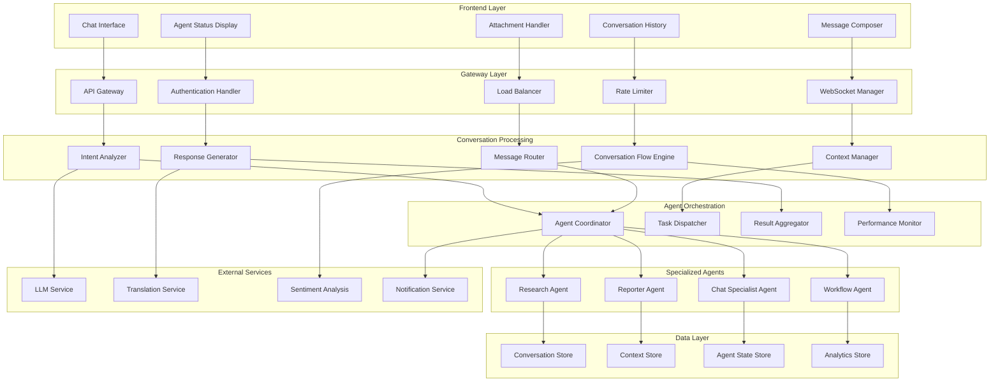

# AI Chat Integration Architecture

## Executive Summary

The AI Chat Integration Architecture provides a sophisticated conversational interface that enables natural language interactions between users and the UrbanAI agent system. This architecture implements advanced conversational AI patterns, agent coordination protocols, and real-time communication capabilities to deliver intelligent urban issue management through intuitive chat experiences.

## Architecture Overview

### System Design Principles

- **Natural Language Understanding**: Advanced NLP capabilities for comprehending user intent and context
- **Multi-Agent Coordination**: Seamless collaboration between specialized agents for comprehensive responses
- **Real-Time Communication**: Low-latency WebSocket connections for interactive dialogue
- **Context Management**: Sophisticated conversation state tracking across multiple sessions
- **Intelligent Routing**: Dynamic agent selection based on user requirements and conversation context
- **Security & Privacy**: End-to-end encryption and compliance with data protection regulations

### Core Components



## Technical Implementation

### Chat Service Layer

#### Chat Service Architecture

```csharp
// Chat Service Interface
public interface IChatService
{
    Task<ChatMessage> SendMessageAsync(ChatMessageRequest request);
    Task<Conversation> GetConversationAsync(Guid conversationId);
    Task<IEnumerable<ChatMessage>> GetMessagesAsync(Guid conversationId, int limit = 50);
    Task<Conversation> StartConversationAsync(ConversationStartRequest request);
    Task EndConversationAsync(Guid conversationId);
    Task<IEnumerable<Conversation>> GetUserConversationsAsync(Guid userId);
    Task<TypingIndicator> UpdateTypingStatusAsync(TypingIndicatorRequest request);
}

// Chat Message Request Model
public class ChatMessageRequest
{
    public Guid ConversationId { get; set; }
    public string Message { get; set; }
    public string MessageType { get; set; } = "text";
    public Dictionary<string, object> Metadata { get; set; } = new();
    public List<Attachment> Attachments { get; set; } = new();
}

// Chat Service Implementation
public class ChatService : IChatService
{
    private readonly IIntentAnalyzer _intentAnalyzer;
    private readonly IContextManager _contextManager;
    private readonly IAgentCoordinator _agentCoordinator;
    private readonly IConversationRepository _conversationRepository;
    private readonly ILogger<ChatService> _logger;

    public ChatService(
        IIntentAnalyzer intentAnalyzer,
        IContextManager contextManager,
        IAgentCoordinator agentCoordinator,
        IConversationRepository conversationRepository,
        ILogger<ChatService> logger)
    {
        _intentAnalyzer = intentAnalyzer;
        _contextManager = contextManager;
        _agentCoordinator = agentCoordinator;
        _conversationRepository = conversationRepository;
        _logger = logger;
    }

    public async Task<ChatMessage> SendMessageAsync(ChatMessageRequest request)
    {
        try
        {
            // Analyze user intent
            var intent = await _intentAnalyzer.AnalyzeIntentAsync(request.Message);

            // Get conversation context
            var context = await _contextManager.GetContextAsync(request.ConversationId);

            // Route to appropriate agent
            var agentResponse = await _agentCoordinator.ProcessMessageAsync(
                request.Message,
                intent,
                context
            );

            // Generate user-friendly response
            var response = await GenerateResponseAsync(agentResponse, context);

            // Update conversation context
            await _contextManager.UpdateContextAsync(request.ConversationId, response);

            return response;
        }
        catch (Exception ex)
        {
            _logger.LogError(ex, "Error processing chat message");
            throw;
        }
    }

    private async Task<ChatMessage> GenerateResponseAsync(
        AgentResponse agentResponse,
        ConversationContext context)
    {
        // Implementation for generating natural language responses
        // based on agent responses and conversation context
    }
}
```

### Intent Analysis Engine

```csharp
// Intent Analyzer Interface
public interface IIntentAnalyzer
{
    Task<UserIntent> AnalyzeIntentAsync(string message);
    Task<EntityExtraction> ExtractEntitiesAsync(string message);
    Task<SentimentAnalysis> AnalyzeSentimentAsync(string message);
    Task<ConversationType> DetermineConversationTypeAsync(string message, ConversationContext context);
}

// Intent Analyzer Implementation
public class IntentAnalyzer : IIntentAnalyzer
{
    private readonly ILLMService _llmService;
    private readonly IEntityExtractor _entityExtractor;
    private readonly ISentimentAnalyzer _sentimentAnalyzer;

    public async Task<UserIntent> AnalyzeIntentAsync(string message)
    {
        var prompt = $"""
        Analyze the following user message to determine their intent:

        Message: "{message}"

        Classify the intent into one of these categories:
        - ISSUE_REPORT: User wants to report a new urban issue
        - STATUS_INQUIRY: User wants to check status of existing issue
        - RESEARCH_REQUEST: User wants to research regulations or similar cases
        - GENERAL_INQUIRY: User has general questions about the system
        - ESCALATION: User wants to escalate an issue
        - FEEDBACK: User is providing feedback
        - TECHNICAL_SUPPORT: User needs technical assistance

        Return JSON with: intent, confidence (0-1), entities, action_required
        """;

        var response = await _llmService.GenerateResponseAsync(prompt);
        return JsonConvert.DeserializeObject<UserIntent>(response);
    }
}

// User Intent Model
public class UserIntent
{
    public string Intent { get; set; }
    public double Confidence { get; set; }
    public Dictionary<string, string> Entities { get; set; }
    public bool ActionRequired { get; set; }
    public string ClarificationQuestion { get; set; }
}
```

### Context Management System

```csharp
// Context Manager Interface
public interface IContextManager
{
    Task<ConversationContext> GetContextAsync(Guid conversationId);
    Task UpdateContextAsync(Guid conversationId, ChatMessage message);
    Task AddContextDataAsync(Guid conversationId, string key, object value);
    Task<T> GetContextDataAsync<T>(Guid conversationId, string key);
    Task ClearContextAsync(Guid conversationId);
    Task ExportContextAsync(Guid conversationId);
}

// Context Manager Implementation
public class ContextManager : IContextManager
{
    private readonly IContextRepository _contextRepository;
    private readonly IMemoryCache _cache;
    private readonly ILogger<ContextManager> _logger;

    public async Task<ConversationContext> GetContextAsync(Guid conversationId)
    {
        // Try cache first
        var cacheKey = $"conversation_context_{conversationId}";
        if (_cache.TryGetValue(cacheKey, out ConversationContext cachedContext))
        {
            return cachedContext;
        }

        // Load from repository
        var context = await _contextRepository.GetContextAsync(conversationId);

        // Cache for 30 minutes
        _cache.Set(cacheKey, context, TimeSpan.FromMinutes(30));

        return context;
    }

    public async Task UpdateContextAsync(Guid conversationId, ChatMessage message)
    {
        var context = await GetContextAsync(conversationId);

        // Update conversation history
        context.Messages.Add(message);

        // Update last activity
        context.LastActivity = DateTime.UtcNow;

        // Extract and store entities
        var entities = await ExtractEntitiesFromMessageAsync(message);
        foreach (var entity in entities)
        {
            context.Entities[entity.Key] = entity.Value;
        }

        // Update conversation state
        context.State = await DetermineConversationStateAsync(context);

        // Save updated context
        await _contextRepository.UpdateContextAsync(conversationId, context);

        // Update cache
        var cacheKey = $"conversation_context_{conversationId}";
        _cache.Set(cacheKey, context, TimeSpan.FromMinutes(30));
    }
}

// Conversation Context Model
public class ConversationContext
{
    public Guid ConversationId { get; set; }
    public Guid UserId { get; set; }
    public List<ChatMessage> Messages { get; set; } = new();
    public Dictionary<string, object> Entities { get; set; } = new();
    public Dictionary<string, object> UserData { get; set; } = new();
    public ConversationState State { get; set; }
    public DateTime LastActivity { get; set; }
    public Guid? CurrentIssueId { get; set; }
    public List<string> ActiveAgents { get; set; } = new();
    public Dictionary<string, object> AgentContexts { get; set; } = new();
}
```

### Agent Coordination System

```csharp
// Agent Coordinator Interface
public interface IAgentCoordinator
{
    Task<AgentResponse> ProcessMessageAsync(string message, UserIntent intent, ConversationContext context);
    Task<AgentResponse> CoordinateAgentsAsync(AgentRequest request);
    Task RegisterAgentAsync(IAgent agent);
    Task UnregisterAgentAsync(string agentId);
    Task<Dictionary<string, AgentStatus>> GetAgentStatusesAsync();
}

// Agent Coordinator Implementation
public class AgentCoordinator : IAgentCoordinator
{
    private readonly Dictionary<string, IAgent> _agents = new();
    private readonly ILogger<AgentCoordinator> _logger;

    public async Task<AgentResponse> ProcessMessageAsync(
        string message,
        UserIntent intent,
        ConversationContext context)
    {
        try
        {
            // Select appropriate agents based on intent
            var selectedAgents = SelectAgentsForIntent(intent);

            // Create agent request
            var agentRequest = new AgentRequest
            {
                Message = message,
                Intent = intent,
                Context = context,
                Timestamp = DateTime.UtcNow,
                RequestId = Guid.NewGuid().ToString()
            };

            // Coordinate agent responses
            var response = await CoordinateAgentsAsync(agentRequest);

            return response;
        }
        catch (Exception ex)
        {
            _logger.LogError(ex, "Error coordinating agents for message processing");
            throw;
        }
    }

    private List<string> SelectAgentsForIntent(UserIntent intent)
    {
        return intent.Intent switch
        {
            "ISSUE_REPORT" => new List<string> { "ReporterAgent", "ChatAgent" },
            "STATUS_INQUIRY" => new List<string> { "ReporterAgent", "ChatAgent" },
            "RESEARCH_REQUEST" => new List<string> { "ResearchAgent", "ChatAgent" },
            "ESCALATION" => new List<string> { "WorkflowAgent", "ReporterAgent" },
            "TECHNICAL_SUPPORT" => new List<string> { "ChatAgent", "WorkflowAgent" },
            _ => new List<string> { "ChatAgent" }
        };
    }

    public async Task<AgentResponse> CoordinateAgentsAsync(AgentRequest request)
    {
        var responses = new List<AgentMessage>();
        var cancellationTokenSource = new CancellationTokenSource();

        // Set timeout for agent responses
        cancellationTokenSource.CancelAfter(TimeSpan.FromSeconds(30));

        // Execute agents in parallel
        var tasks = _agents
            .Where(a => ShouldExecuteAgent(a.Key, request.Intent))
            .Select(async agent =>
            {
                try
                {
                    var response = await agent.Value.ProcessRequestAsync(request, cancellationTokenSource.Token);
                    return new AgentMessage
                    {
                        AgentId = agent.Key,
                        Response = response,
                        Timestamp = DateTime.UtcNow,
                        Success = true
                    };
                }
                catch (Exception ex)
                {
                    _logger.LogError(ex, "Error executing agent {AgentId}", agent.Key);
                    return new AgentMessage
                    {
                        AgentId = agent.Key,
                        Response = $"Error: {ex.Message}",
                        Timestamp = DateTime.UtcNow,
                        Success = false
                    };
                }
            });

        var results = await Task.WhenAll(tasks);
        responses.AddRange(results.Where(r => r.Success));

        // Aggregate responses
        return await AggregateResponsesAsync(responses, request);
    }

    private async Task<AgentResponse> AggregateResponsesAsync(
        List<AgentMessage> responses,
        AgentRequest request)
    {
        // Implementation for combining multiple agent responses
        // into a coherent response for the user
    }
}
```

### WebSocket Integration

```csharp
// WebSocket Handler
public class ChatWebSocketHandler
{
    private readonly IChatService _chatService;
    private readonly IConnectionManager _connectionManager;
    private readonly ILogger<ChatWebSocketHandler> _logger;

    public async Task HandleConnectionAsync(WebSocket webSocket, Guid userId)
    {
        var connectionId = Guid.NewGuid().ToString();

        // Register connection
        await _connectionManager.AddConnectionAsync(connectionId, userId, webSocket);

        try
        {
            await ReceiveMessagesAsync(webSocket, connectionId, userId);
        }
        finally
        {
            // Cleanup connection
            await _connectionManager.RemoveConnectionAsync(connectionId);
        }
    }

    private async Task ReceiveMessagesAsync(WebSocket webSocket, string connectionId, Guid userId)
    {
        var buffer = new byte[1024 * 4];

        while (webSocket.State == WebSocketState.Open)
        {
            var result = await webSocket.ReceiveAsync(new ArraySegment<byte>(buffer), CancellationToken.None);

            if (result.MessageType == WebSocketMessageType.Close)
            {
                await webSocket.CloseAsync(
                    WebSocketCloseStatus.NormalClosure,
                    "Closing",
                    CancellationToken.None);
                break;
            }

            if (result.MessageType == WebSocketMessageType.Text)
            {
                var messageJson = Encoding.UTF8.GetString(buffer, 0, result.Count);
                var message = JsonConvert.DeserializeObject<WebSocketMessage>(messageJson);

                await ProcessWebSocketMessageAsync(message, connectionId, userId);
            }
        }
    }

    private async Task ProcessWebSocketMessageAsync(
        WebSocketMessage message,
        string connectionId,
        Guid userId)
    {
        try
        {
            switch (message.Type)
            {
                case "chat":
                    await HandleChatMessageAsync(message, connectionId, userId);
                    break;

                case "typing_start":
                    await HandleTypingStartAsync(connectionId, userId);
                    break;

                case "typing_end":
                    await HandleTypingEndAsync(connectionId, userId);
                    break;

                case "read_receipt":
                    await HandleReadReceiptAsync(message, connectionId, userId);
                    break;
            }
        }
        catch (Exception ex)
        {
            _logger.LogError(ex, "Error processing WebSocket message");
        }
    }
}

// WebSocket Message Model
public class WebSocketMessage
{
    public string Type { get; set; }
    public string Message { get; set; }
    public Guid? ConversationId { get; set; }
    public Dictionary<string, object> Data { get; set; } = new();
}
```

## Frontend Integration

### React Chat Components

```typescript
// Chat Interface Component
interface ChatInterfaceProps {
  userId: string;
  conversationId?: string;
  onMessageSent?: (message: ChatMessage) => void;
  onAgentStatusChange?: (status: AgentStatus[]) => void;
}

export const ChatInterface: React.FC<ChatInterfaceProps> = ({
  userId,
  conversationId,
  onMessageSent,
  onAgentStatusChange
}) => {
  const [messages, setMessages] = useState<ChatMessage[]>([]);
  const [inputMessage, setInputMessage] = useState('');
  const [isLoading, setIsLoading] = useState(false);
  const [isTyping, setIsTyping] = useState(false);
  const [agentStatus, setAgentStatus] = useState<AgentStatus[]>([]);

  const { socket, isConnected } = useWebSocket(userId);
  const { sendMessage, markAsRead } = useChatService();

  useEffect(() => {
    if (conversationId) {
      loadConversation(conversationId);
    }
  }, [conversationId]);

  useEffect(() => {
    if (socket) {
      socket.on('message', handleNewMessage);
      socket.on('typing_start', handleTypingStart);
      socket.on('typing_end', handleTypingEnd);
      socket.on('agent_status', handleAgentStatusUpdate);
    }
  }, [socket]);

  const handleSendMessage = async () => {
    if (!inputMessage.trim() || isLoading) return;

    const message: ChatMessageRequest = {
      conversationId,
      message: inputMessage,
      messageType: 'text',
      metadata: {}
    };

    setIsLoading(true);
    try {
      const response = await sendMessage(message);
      setMessages(prev => [...prev, response]);
      setInputMessage('');
      onMessageSent?.(response);
    } catch (error) {
      console.error('Error sending message:', error);
    } finally {
      setIsLoading(false);
    }
  };

  const handleTypingStart = useCallback(() => {
    setIsTyping(true);
    socket?.emit('typing_start', { conversationId });
  }, [socket, conversationId]);

  const handleTypingEnd = useCallback(() => {
    setIsTyping(false);
    socket?.emit('typing_end', { conversationId });
  }, [socket, conversationId]);

  return (
    <div className="chat-interface">
      <div className="chat-header">
        <h2>UrbanAI Assistant</h2>
        <AgentStatusIndicator agents={agentStatus} />
      </div>

      <div className="messages-container">
        {messages.map((message) => (
          <MessageComponent
            key={message.id}
            message={message}
            userId={userId}
            onReadReceipt={markAsRead}
          />
        ))}
        {isTyping && <TypingIndicator />}
      </div>

      <div className="input-container">
        <textarea
          value={inputMessage}
          onChange={(e) => setInputMessage(e.target.value)}
          onFocus={handleTypingStart}
          onBlur={handleTypingEnd}
          placeholder="Type your message..."
          disabled={isLoading}
        />
        <button
          onClick={handleSendMessage}
          disabled={!inputMessage.trim() || isLoading}
        >
          {isLoading ? 'Sending...' : 'Send'}
        </button>
      </div>
    </div>
  );
};

// Message Component
interface MessageComponentProps {
  message: ChatMessage;
  userId: string;
  onReadReceipt?: (messageId: string) => void;
}

export const MessageComponent: React.FC<MessageComponentProps> = ({
  message,
  userId,
  onReadReceipt
}) => {
  const isUser = message.senderId === userId;
  const [isRead, setIsRead] = useState(false);

  useEffect(() => {
    if (!isUser && !isRead) {
      onReadReceipt?.(message.id);
      setIsRead(true);
    }
  }, [isUser, isRead, onReadReceipt]);

  return (
    <div className={`message ${isUser ? 'user' : 'agent'}`}>
      <div className="message-header">
        <span className="sender">{message.senderName}</span>
        <span className="timestamp">
          {formatTimestamp(message.timestamp)}
        </span>
      </div>
      <div className="message-content">
        {message.attachments?.map((attachment) => (
          <AttachmentComponent
            key={attachment.id}
            attachment={attachment}
          />
        ))}
        <div className="message-text">{message.content}</div>
      </div>
      {message.agentResponses?.map((response) => (
        <AgentResponseComponent
          key={response.agentId}
          response={response}
        />
      ))}
    </div>
  );
};
```

### Service Layer Integration

```typescript
// Chat Service
export class ChatService {
  private readonly apiClient: ApiClient;
  private readonly socketManager: SocketManager;

  constructor(
    apiClient: ApiClient,
    socketManager: SocketManager
  ) {
    this.apiClient = apiClient;
    this.socketManager = socketManager;
  }

  async sendMessage(request: ChatMessageRequest): Promise<ChatMessage> {
    return this.apiClient.post<ChatMessage>('/api/chat/send', request);
  }

  async getConversation(conversationId: string): Promise<Conversation> {
    return this.apiClient.get<Conversation>(`/api/chat/conversation/${conversationId}`);
  }

  async getMessages(conversationId: string, limit = 50): Promise<ChatMessage[]> {
    return this.apiClient.get<ChatMessage[]>(
      `/api/chat/conversation/${conversationId}/messages?limit=${limit}`
    );
  }

  async startConversation(request: ConversationStartRequest): Promise<Conversation> {
    return this.apiClient.post<Conversation>('/api/chat/start', request);
  }

  async markAsRead(messageId: string): Promise<void> {
    await this.apiClient.post(`/api/chat/message/${messageId}/read`, {});
  }

  // WebSocket Methods
  connect(userId: string): Promise<Socket> {
    return this.socketManager.connect(userId);
  }

  disconnect(): void {
    this.socketManager.disconnect();
  }

  onMessage(callback: (message: ChatMessage) => void): void {
    this.socketManager.on('message', callback);
  }

  onTypingStart(callback: (data: TypingIndicator) => void): void {
    this.socketManager.on('typing_start', callback);
  }

  onTypingEnd(callback: (data: TypingIndicator) => void): void {
    this.socketManager.on('typing_end', callback);
  }

  onAgentStatus(callback: (status: AgentStatus[]) => void): void {
    this.socketManager.on('agent_status', callback);
  }
}

// Store for managing chat state
interface ChatState {
  conversations: Conversation[];
  activeConversation: Conversation | null;
  messages: ChatMessage[];
  isLoading: boolean;
  error: string | null;
}

export const useChatStore = create<ChatState>((set, get) => ({
  conversations: [],
  activeConversation: null,
  messages: [],
  isLoading: false,
  error: null,

  setActiveConversation: (conversation: Conversation | null) => {
    set({ activeConversation: conversation });
    if (conversation) {
      get().loadMessages(conversation.id);
    }
  },

  loadConversations: async (userId: string) => {
    set({ isLoading: true, error: null });
    try {
      const conversations = await chatService.getUserConversations(userId);
      set({ conversations, isLoading: false });
    } catch (error) {
      set({ error: error.message, isLoading: false });
    }
  },

  loadMessages: async (conversationId: string) => {
    set({ isLoading: true, error: null });
    try {
      const messages = await chatService.getMessages(conversationId);
      set({ messages, isLoading: false });
    } catch (error) {
      set({ error: error.message, isLoading: false });
    }
  },

  sendMessage: async (request: ChatMessageRequest) => {
    set({ isLoading: true, error: null });
    try {
      const message = await chatService.sendMessage(request);
      set((state) => ({
        messages: [...state.messages, message],
        isLoading: false
      }));
      return message;
    } catch (error) {
      set({ error: error.message, isLoading: false });
      throw error;
    }
  }
}));
```

## Security Implementation

### Authentication & Authorization

```csharp
// Chat Authentication Service
public class ChatAuthenticationService
{
    private readonly IJwtTokenService _jwtTokenService;
    private readonly IAuthorizationService _authorizationService;
    private readonly ILogger<ChatAuthenticationService> _logger;

    public async Task<AuthenticationResult> AuthenticateAsync(string token)
    {
        try
        {
            // Validate JWT token
            var validationResult = await _jwtTokenService.ValidateTokenAsync(token);

            if (!validationResult.IsValid)
            {
                return new AuthenticationResult { IsAuthenticated = false };
            }

            // Check user permissions
            var hasPermission = await _authorizationService.HasPermissionAsync(
                validationResult.UserId,
                "chat.access"
            );

            if (!hasPermission)
            {
                _logger.LogWarning("User {UserId} attempted to access chat without permission",
                    validationResult.UserId);
                return new AuthenticationResult { IsAuthenticated = false };
            }

            return new AuthenticationResult
            {
                IsAuthenticated = true,
                UserId = validationResult.UserId,
                Username = validationResult.Username,
                Roles = validationResult.Roles
            };
        }
        catch (Exception ex)
        {
            _logger.LogError(ex, "Error authenticating chat user");
            return new AuthenticationResult { IsAuthenticated = false };
        }
    }

    public async Task<bool> AuthorizeConversationAccessAsync(Guid userId, Guid conversationId)
    {
        // Check if user has access to specific conversation
        return await _authorizationService.HasConversationAccessAsync(userId, conversationId);
    }
}

// Message Sanitization Service
public class MessageSanitizationService
{
    private readonly IHtmlSanitizer _htmlSanitizer;
    private readonly IContentModerationService _contentModerationService;

    public async Task<string> SanitizeMessageAsync(string message)
    {
        // Remove HTML/Script tags
        var sanitized = _htmlSanitizer.Sanitize(message);

        // Check for inappropriate content
        var moderationResult = await _contentModerationService.ModerateContentAsync(sanitized);

        if (moderationResult.IsInappropriate)
        {
            throw new InappropriateContentException("Message contains inappropriate content");
        }

        return sanitized;
    }

    public async Task<bool> ValidateAttachmentAsync(Attachment attachment)
    {
        // Validate file type, size, and scan for malware
        var allowedTypes = new[] { "image/jpeg", "image/png", "application/pdf" };
        var maxSize = 10 * 1024 * 1024; // 10MB

        if (!allowedTypes.Contains(attachment.ContentType))
        {
            return false;
        }

        if (attachment.Size > maxSize)
        {
            return false;
        }

        return await _contentModerationService.ScanAttachmentAsync(attachment);
    }
}
```

### Data Protection

```csharp
// Chat Data Protection Service
public class ChatDataProtectionService
{
    private readonly IEncryptionService _encryptionService;
    private readonly IDataRetentionService _dataRetentionService;
    private readonly IAnonymousUserService _anonymousUserService;

    public async Task<ProtectedChatData> ProtectSensitiveDataAsync(ChatMessage message)
    {
        var protectedData = new ProtectedChatData
        {
            OriginalMessage = message,
            ProtectedContent = message.Content,
            SensitiveDataFound = false,
            DataMaskingApplied = false
        };

        // Detect and mask PII
        var piiDetection = await DetectPIIAsync(message.Content);
        if (piiDetection.PIIFound)
        {
            protectedData.ProtectedContent = MaskPIIAsync(message.Content, piiDetection.Entities);
            protectedData.SensitiveDataFound = true;
            protectedData.DataMaskingApplied = true;
        }

        // Encrypt sensitive conversation data
        if (message.Metadata.ContainsKey("sensitive"))
        {
            protectedData.EncryptedMetadata = await _encryptionService.EncryptAsync(
                JsonConvert.SerializeObject(message.Metadata)
            );
        }

        return protectedData;
    }

    public async Task<string> MaskPIIAsync(string content, List<PIIEntity> entities)
    {
        var maskedContent = content;

        foreach (var entity in entities.OrderByDescending(e => e.StartIndex))
        {
            var mask = entity.Type switch
            {
                "email" => "[EMAIL_REDACTED]",
                "phone" => "[PHONE_REDACTED]",
                "address" => "[ADDRESS_REDACTED]",
                "name" => "[NAME_REDACTED]",
                _ => "[SENSITIVE_DATA]"
            };

            maskedContent = maskedContent.Remove(entity.StartIndex, entity.Length)
                                     .Insert(entity.StartIndex, mask);
        }

        return maskedContent;
    }

    public async Task ApplyDataRetentionAsync(Guid conversationId)
    {
        // Apply data retention policies
        var retentionPolicy = await _dataRetentionService.GetRetentionPolicyAsync("chat_conversations");

        if (retentionPolicy.RetentionPeriod > 0)
        {
            var cutoffDate = DateTime.UtcNow.AddDays(-retentionPolicy.RetentionPeriod);
            await _dataRetentionService.ApplyRetentionAsync(conversationId, cutoffDate);
        }
    }
}
```

## Performance Optimization

### Caching Strategy

```csharp
// Chat Caching Service
public class ChatCachingService
{
    private readonly IDistributedCache _cache;
    private readonly ILogger<ChatCachingService> _logger;

    public async Task<ConversationContext> GetOrSetContextAsync(
        Guid conversationId,
        Func<Task<ConversationContext>> factory)
    {
        var cacheKey = $"chat_context_{conversationId}";
        var cachedContext = await _cache.GetAsync(cacheKey);

        if (cachedContext != null)
        {
            return JsonConvert.DeserializeObject<ConversationContext>(
                Encoding.UTF8.GetString(cachedContext)
            );
        }

        var context = await factory();
        var serializedContext = JsonConvert.SerializeObject(context);

        var cacheOptions = new DistributedCacheEntryOptions
        {
            AbsoluteExpirationRelativeToNow = TimeSpan.FromHours(1),
            SlidingExpiration = TimeSpan.FromMinutes(30)
        };

        await _cache.SetAsync(cacheKey,
            Encoding.UTF8.GetBytes(serializedContext),
            cacheOptions);

        return context;
    }

    public async Task InvalidateCacheAsync(Guid conversationId)
    {
        var cacheKeys = new[]
        {
            $"chat_context_{conversationId}",
            $"chat_messages_{conversationId}",
            $"chat_agents_{conversationId}"
        };

        foreach (var cacheKey in cacheKeys)
        {
            await _cache.RemoveAsync(cacheKey);
        }
    }

    public async Task PreloadCommonResponsesAsync()
    {
        var commonResponses = new[]
        {
            "greeting",
            "issue_report_confirmation",
            "status_update_template",
            "escalation_acknowledgment",
            "technical_support_response"
        };

        foreach (var response in commonResponses)
        {
            var cacheKey = $"chat_response_{response}";
            var cachedResponse = await _cache.GetAsync(cacheKey);

            if (cachedResponse == null)
            {
                var responseContent = await GenerateResponseTemplateAsync(response);
                await _cache.SetAsync(cacheKey,
                    Encoding.UTF8.GetBytes(responseContent),
                    new DistributedCacheEntryOptions
                    {
                        AbsoluteExpirationRelativeToNow = TimeSpan.FromDays(1)
                    });
            }
        }
    }
}
```

### Load Balancing & Scaling

```csharp
// Chat Load Balancer
public class ChatLoadBalancer
{
    private readonly IAgentPool _agentPool;
    private readonly IPerformanceMonitor _performanceMonitor;
    private readonly ILogger<ChatLoadBalancer> _logger;

    public async Task<IAgent> SelectOptimalAgentAsync(string agentType, ConversationContext context)
    {
        var availableAgents = await _agentPool.GetAvailableAgentsAsync(agentType);

        if (!availableAgents.Any())
        {
            throw new NoAvailableAgentsException($"No {agentType} agents available");
        }

        // Select agent based on performance metrics and load
        var selectedAgent = availableAgents
            .OrderByDescending(a => CalculateAgentScore(a))
            .First();

        // Reserve agent for this conversation
        await _agentPool.ReserveAgentAsync(selectedAgent.Id, context.ConversationId);

        return selectedAgent;
    }

    private double CalculateAgentScore(IAgent agent)
    {
        var performanceMetrics = _performanceMonitor.GetMetrics(agent.Id);

        // Score based on multiple factors
        var responseTimeScore = Math.Max(0, 1 - (performanceMetrics.AverageResponseTime / 5000));
        var successRateScore = performanceMetrics.SuccessRate;
        var currentLoadScore = 1 - (performanceMetrics.CurrentLoad / 100);
        var errorRateScore = Math.Max(0, 1 - performanceMetrics.ErrorRate);

        return (responseTimeScore * 0.3) +
               (successRateScore * 0.3) +
               (currentLoadScore * 0.25) +
               (errorRateScore * 0.15);
    }

    public async Task ScaleAgentsAsync(string agentType, int requiredCount)
    {
        var currentCount = await _agentPool.GetAgentCountAsync(agentType);
        var neededCount = requiredCount - currentCount;

        if (neededCount > 0)
        {
            // Scale up
            for (var i = 0; i < neededCount; i++)
            {
                await _agentPool.CreateAgentAsync(agentType);
            }
        }
        else if (neededCount < 0)
        {
            // Scale down
            await _agentPool.RemoveAgentsAsync(agentType, Math.Abs(neededCount));
        }
    }
}
```

## Monitoring & Analytics

### Chat Analytics Service

```csharp
// Chat Analytics Service
public class ChatAnalyticsService
{
    private readonly IAnalyticsRepository _analyticsRepository;
    private readonly ILogger<ChatAnalyticsService> _logger;

    public async Task TrackConversationMetricsAsync(Conversation conversation)
    {
        var metrics = new ConversationMetrics
        {
            ConversationId = conversation.Id,
            UserId = conversation.UserId,
            Duration = conversation.EndTime - conversation.StartTime,
            MessageCount = conversation.Messages.Count,
            AgentTypes = conversation.Messages
                .Where(m => m.AgentResponses.Any())
                .SelectMany(m => m.AgentResponses.Select(ar => ar.AgentId))
                .Distinct()
                .ToList(),
            ResolutionStatus = await DetermineResolutionStatusAsync(conversation),
            UserSatisfaction = await CalculateUserSatisfactionAsync(conversation),
            ResponseTimes = CalculateResponseTimes(conversation),
            AgentPerformance = await CalculateAgentPerformanceAsync(conversation)
        };

        await _analyticsRepository.SaveMetricsAsync(metrics);
    }

    public async Task<ChatAnalyticsReport> GenerateAnalyticsReportAsync(
        DateTime startDate,
        DateTime endDate)
    {
        var conversations = await _analyticsRepository.GetConversationsAsync(startDate, endDate);

        return new ChatAnalyticsReport
        {
            TotalConversations = conversations.Count,
            AverageDuration = conversations.Average(c => c.Duration.TotalMinutes),
            AverageResponseTime = conversations.Average(c => c.AverageResponseTime.TotalSeconds),
            ResolutionRate = conversations.Count(c => c.ResolutionStatus == "resolved") / (double)conversations.Count,
            TopAgentTypes = conversations
                .SelectMany(c => c.AgentTypes)
                .GroupBy(a => a)
                .OrderByDescending(g => g.Count())
                .Take(5)
                .Select(g => new { AgentType = g.Key, Count = g.Count() })
                .ToList(),
            UserSatisfactionScore = conversations.Average(c => c.UserSatisfaction),
            PeakHours = GetPeakHours(conversations),
            CommonIntents = await GetCommonIntentsAsync(conversations)
        };
    }

    public async Task<RealTimeMetrics> GetRealTimeMetricsAsync()
    {
        var activeConversations = await _analyticsRepository.GetActiveConversationsAsync();
        var agentStatuses = await _analyticsRepository.GetAgentStatusesAsync();

        return new RealTimeMetrics
        {
            ActiveConversations = activeConversations.Count,
            ActiveUsers = activeConversations.Select(c => c.UserId).Distinct().Count(),
            AgentUtilization = agentStatuses.Average(a => a.Utilization),
            AverageResponseTime = agentStatuses.Average(a => a.AverageResponseTime),
            MessagesPerMinute = await CalculateMessagesPerMinuteAsync(),
            ErrorRate = await CalculateErrorRateAsync()
        };
    }
}
```

## API Specifications

### Chat API Endpoints

```yaml
# Chat API Specification
openapi: 3.0.3
info:
  title: UrbanAI Chat API
  version: 1.0.0
  description: API for AI-powered chat integration with UrbanAI agents

paths:
  /api/chat/send:
    post:
      summary: Send a chat message
      security:
        - BearerAuth: []
      requestBody:
        required: true
        content:
          application/json:
            schema:
              $ref: '#/components/schemas/ChatMessageRequest'
      responses:
        '200':
          description: Message sent successfully
          content:
            application/json:
              schema:
                $ref: '#/components/schemas/ChatMessage'
        '400':
          description: Invalid request
        '401':
          description: Unauthorized
        '429':
          description: Rate limit exceeded

  /api/chat/conversation/{conversationId}:
    get:
      summary: Get conversation details
      security:
        - BearerAuth: []
      parameters:
        - name: conversationId
          in: path
          required: true
          schema:
            type: string
            format: uuid
      responses:
        '200':
          description: Conversation details
          content:
            application/json:
              schema:
                $ref: '#/components/schemas/Conversation'
        '404':
          description: Conversation not found

  /api/chat/conversation/{conversationId}/messages:
    get:
      summary: Get conversation messages
      security:
        - BearerAuth: []
      parameters:
        - name: conversationId
          in: path
          required: true
          schema:
            type: string
            format: uuid
        - name: limit
          in: query
          schema:
            type: integer
            default: 50
      responses:
        '200':
          description: Messages retrieved successfully
          content:
            application/json:
              schema:
                type: array
                items:
                  $ref: '#/components/schemas/ChatMessage'

components:
  schemas:
    ChatMessageRequest:
      type: object
      properties:
        conversationId:
          type: string
          format: uuid
        message:
          type: string
          maxLength: 2000
        messageType:
          type: string
          enum: [text, image, file, system]
          default: text
        metadata:
          type: object
          additionalProperties: true
        attachments:
          type: array
          items:
            $ref: '#/components/schemas/Attachment'

    ChatMessage:
      type: object
      properties:
        id:
          type: string
          format: uuid
        conversationId:
          type: string
          format: uuid
        senderId:
          type: string
          format: uuid
        senderName:
          type: string
        content:
          type: string
        messageType:
          type: string
        timestamp:
          type: string
          format: date-time
        attachments:
          type: array
          items:
            $ref: '#/components/schemas/Attachment'
        agentResponses:
          type: array
          items:
            $ref: '#/components/schemas/AgentResponse'
        isRead:
          type: boolean
          default: false

    AgentResponse:
      type: object
      properties:
        agentId:
          type: string
        agentName:
          type: string
        response:
          type: string
        confidence:
          type: number
          format: float
          minimum: 0
          maximum: 1
        processingTime:
          type: integer
          format: int64
        metadata:
          type: object
          additionalProperties: true

    Conversation:
      type: object
      properties:
        id:
          type: string
          format: uuid
        userId:
          type: string
          format: uuid
        title:
          type: string
        startTime:
          type: string
          format: date-time
        endTime:
          type: string
          format: date-time
        status:
          type: string
          enum: [active, closed, archived]
        messageCount:
          type: integer
        lastActivity:
          type: string
          format: date-time
        participants:
          type: array
          items:
            $ref: '#/components/schemas/Participant'
        tags:
          type: array
          items:
            type: string

    Attachment:
      type: object
      properties:
        id:
          type: string
          format: uuid
        fileName:
          type: string
        fileType:
          type: string
        fileSize:
          type: integer
          format: int64
        url:
          type: string
          format: uri
        thumbnailUrl:
          type: string
          format: uri

securitySchemes:
  BearerAuth:
    type: http
    scheme: bearer
    bearerFormat: JWT
```

## Deployment Configuration

### Azure Deployment

```yaml
# Azure Functions Configuration (host.json)
{
  "version": "2.0",
  "logging": {
    "applicationInsights": {
      "samplingSettings": {
        "isEnabled": true,
        "excludedTypes": "Request"
      }
    },
    "logLevel": {
      "default": "Information",
      "Host.Results": "Error",
      "Function": "Information"
    }
  },
  "extensions": {
    "http": {
      "routePrefix": "api",
      "maxOutstandingRequests": 200,
      "maxConcurrentRequests": 100,
      "dynamicThrottlesEnabled": true
    },
    "webSockets": {
      "enabled": true
    },
    "durableTask": {
      "hubName": "ChatProcessingHub",
      "maxConcurrentActivityFunctions": 10,
      "maxConcurrentOrchestratorFunctions": 5
    }
  },
  "extensionBundle": {
    "id": "Microsoft.Azure.Functions.ExtensionBundle",
    "version": "[4.*, 5.0.0)"
  }
}

# Application Settings (local.settings.json)
{
  "IsEncrypted": false,
  "Values": {
    "AzureWebJobsStorage": "DefaultEndpointsProtocol=https;AccountName=...",
    "FUNCTIONS_WORKER_RUNTIME": "dotnet",
    "WEBSITE_RUN_FROM_PACKAGE": "1",

    # Database Configuration
    "ConnectionStrings__ChatDatabase": "Server=...;Database=UrbanAI_Chat;",

    # LLM Service Configuration
    "OpenAI__ApiKey": "your-openai-api-key",
    "OpenAI__Endpoint": "https://api.openai.com/v1",
    "OpenAI__DeploymentName": "gpt-4",

    # Authentication
    "Jwt__SecretKey": "your-jwt-secret-key",
    "Jwt__Issuer": "https://urbanai-api.azurewebsites.net",
    "Jwt__Audience": "https://urbanai-api.azurewebsites.net",

    # Redis Cache
    "Redis__ConnectionString": "your-redis-connection-string",

    # Application Insights
    "APPINSIGHTS_INSTRUMENTATIONKEY": "your-app-insights-key",

    # WebSocket Configuration
    "WebSocket__MaxConnections": "1000",
    "WebSocket__MessageSizeLimit": "1048576",

    # Rate Limiting
    "RateLimit__PerUser": "100",
    "RateLimit__Window": "60"
  }
}
```

## Testing Strategy

### Unit Tests

```csharp
// Chat Service Tests
public class ChatServiceTests
{
    private readonly Mock<IIntentAnalyzer> _mockIntentAnalyzer;
    private readonly Mock<IContextManager> _mockContextManager;
    private readonly Mock<IAgentCoordinator> _mockAgentCoordinator;
    private readonly Mock<IConversationRepository> _mockConversationRepository;
    private readonly ChatService _chatService;

    public ChatServiceTests()
    {
        _mockIntentAnalyzer = new Mock<IIntentAnalyzer>();
        _mockContextManager = new Mock<IContextManager>();
        _mockAgentCoordinator = new Mock<IAgentCoordinator>();
        _mockConversationRepository = new Mock<IConversationRepository>();

        _chatService = new ChatService(
            _mockIntentAnalyzer.Object,
            _mockContextManager.Object,
            _mockAgentCoordinator.Object,
            _mockConversationRepository.Object,
            Mock.Of<ILogger<ChatService>>()
        );
    }

    [Fact]
    public async Task SendMessageAsync_WithValidMessage_ReturnsResponse()
    {
        // Arrange
        var request = new ChatMessageRequest
        {
            ConversationId = Guid.NewGuid(),
            Message = "Report a pothole on Main Street"
        };

        var intent = new UserIntent
        {
            Intent = "ISSUE_REPORT",
            Confidence = 0.95,
            Entities = new Dictionary<string, string>
            {
                { "issue_type", "pothole" },
                { "location", "Main Street" }
            },
            ActionRequired = true
        };

        var context = new ConversationContext
        {
            ConversationId = request.ConversationId,
            UserId = Guid.NewGuid(),
            State = ConversationState.Active
        };

        var agentResponse = new AgentResponse
        {
            Success = true,
            Message = "I'll help you report that pothole.",
            Actions = new List<string> { "create_issue" }
        };

        _mockIntentAnalyzer.Setup(x => x.AnalyzeIntentAsync(request.Message))
            .ReturnsAsync(intent);

        _mockContextManager.Setup(x => x.GetContextAsync(request.ConversationId))
            .ReturnsAsync(context);

        _mockAgentCoordinator.Setup(x => x.ProcessMessageAsync(request.Message, intent, context))
            .ReturnsAsync(agentResponse);

        // Act
        var result = await _chatService.SendMessageAsync(request);

        // Assert
        Assert.NotNull(result);
        Assert.Equal("I'll help you report that pothole.", result.Content);
        Assert.True(result.AgentResponses.Any());
    }

    [Fact]
    public async Task SendMessageAsync_WithIntentAnalysisError_ThrowsException()
    {
        // Arrange
        var request = new ChatMessageRequest
        {
            ConversationId = Guid.NewGuid(),
            Message = "Test message"
        };

        _mockIntentAnalyzer.Setup(x => x.AnalyzeIntentAsync(request.Message))
            .ThrowsAsync(new Exception("Intent analysis failed"));

        // Act & Assert
        await Assert.ThrowsAsync<Exception>(() => _chatService.SendMessageAsync(request));
    }
}
```

### Integration Tests

```csharp
// Chat Integration Tests
public class ChatIntegrationTests : IClassFixture<ChatTestFactory>
{
    private readonly ChatTestFactory _factory;
    private readonly HttpClient _client;

    public ChatIntegrationTests(ChatTestFactory factory)
    {
        _factory = factory;
        _client = factory.CreateClient();
    }

    [Fact]
    public async Task SendMessage_EndpointReturnsSuccessResponse()
    {
        // Arrange
        var request = new ChatMessageRequest
        {
            Message = "Hello, I need help with an issue",
            MessageType = "text"
        };

        var content = new StringContent(
            JsonConvert.SerializeObject(request),
            Encoding.UTF8,
            "application/json"
        );

        // Act
        var response = await _client.PostAsync("/api/chat/send", content);

        // Assert
        response.EnsureSuccessStatusCode();
        var responseContent = await response.Content.ReadAsStringAsync();
        var chatMessage = JsonConvert.DeserializeObject<ChatMessage>(responseContent);

        Assert.NotNull(chatMessage);
        Assert.NotEqual(Guid.Empty, chatMessage.ConversationId);
        Assert.NotEmpty(chatMessage.Content);
    }

    [Fact]
    public async Task WebSocketConnection_EstablishesSuccessfully()
    {
        // Arrange
        using var webSocket = new ClientWebSocket();
        var uri = new Uri("wss://localhost/api/chat/connect");

        // Act
        await webSocket.ConnectAsync(uri, CancellationToken.None);

        // Assert
        Assert.Equal(WebSocketState.Open, webSocket.State);

        // Cleanup
        await webSocket.CloseAsync(
            WebSocketCloseStatus.NormalClosure,
            "Closing",
            CancellationToken.None
        );
    }
}
```

### End-to-End Tests

```typescript
// Chat E2E Tests
describe('Chat Interface E2E Tests', () => {
  let page: Page;

  beforeEach(async () => {
    page = await browser.newPage();
    await page.goto('/chat');
    await page.waitForSelector('.chat-interface');
  });

  afterEach(async () => {
    await page.close();
  });

  test('user can send and receive messages', async () => {
    // Type message
    await page.fill('textarea[placeholder="Type your message..."]',
      'I need to report a streetlight issue');

    // Send message
    await page.click('button:has-text("Send")');

    // Wait for response
    await page.waitForSelector('.message.agent');

    // Verify response
    const responseMessage = await page.textContent('.message.agent .message-text');
    expect(responseMessage).toContain('streetlight');
  });

  test('conversation history persists', async () => {
    // Send multiple messages
    await page.fill('textarea', 'First message');
    await page.click('button:has-text("Send")');
    await page.waitForSelector('.message.agent');

    await page.fill('textarea', 'Second message');
    await page.click('button:has-text("Send")');
    await page.waitForSelector('.message.agent:nth-child(2)');

    // Verify all messages are displayed
    const messages = await page.$$('.message');
    expect(messages.length).toBe(4); // 2 user + 2 agent
  });

  test('typing indicators work correctly', async () => {
    // Start typing
    await page.fill('textarea', 'Typing test');
    await page.focus('textarea');

    // Wait for typing indicator (simulated)
    await page.waitForTimeout(1000);

    // Verify typing indicator is shown
    const typingIndicator = await page.$('.typing-indicator');
    expect(typingIndicator).toBeTruthy();
  });
});
```

## Best Practices & Guidelines

### Development Guidelines

1. **Message Processing**
   - Always validate and sanitize user input
   - Implement proper error handling and fallback mechanisms
   - Use asynchronous processing for non-blocking operations
   - Implement proper message queuing for high-volume scenarios

2. **Context Management**
   - Maintain conversation state across multiple interactions
   - Implement proper context expiration and cleanup
   - Use efficient data structures for context storage
   - Implement context versioning for audit purposes

3. **Agent Coordination**
   - Design agents to be stateless and idempotent
   - Implement proper agent discovery and registration
   - Use circuit breakers for agent health monitoring
   - Implement proper agent scaling and load balancing

4. **Security Considerations**
   - Always authenticate and authorize chat requests
   - Implement proper rate limiting and throttling
   - Use encryption for sensitive conversation data
   - Implement proper audit logging for compliance

5. **Performance Optimization**
   - Use appropriate caching strategies for frequently accessed data
   - Implement proper connection pooling and reuse
   - Use compression for large message payloads
   - Implement proper monitoring and alerting

### Monitoring & Observability

1. **Key Metrics to Monitor**
   - Message throughput and latency
   - Agent response times and success rates
   - Conversation duration and resolution rates
   - Error rates and exception patterns
   - Resource utilization (CPU, memory, network)

2. **Logging Best Practices**
   - Use structured logging with correlation IDs
   - Log all important conversation events
   - Implement proper log retention and rotation
   - Use appropriate log levels for different events

3. **Alerting Strategies**
   - Set up alerts for high error rates
   - Monitor agent availability and performance
   - Alert on unusual conversation patterns
   - Monitor resource utilization and scaling events

## Troubleshooting Guide

### Common Issues

1. **WebSocket Connection Issues**
   - Verify WebSocket endpoint is accessible
   - Check authentication token validity
   - Ensure proper CORS configuration
   - Monitor network connectivity and firewalls

2. **Agent Response Delays**
   - Check agent availability and health
   - Monitor agent processing queues
   - Verify agent configuration and dependencies
   - Check for resource constraints

3. **Context Management Problems**
   - Verify context storage and retrieval
   - Check context expiration policies
   - Monitor context synchronization issues
   - Verify context serialization/deserialization

4. **Authentication Issues**
   - Verify JWT token validity and expiration
   - Check user permissions and roles
   - Monitor authentication service health
   - Verify token refresh mechanisms

### Debugging Tools

1. **Real-time Monitoring**
   - Use Application Insights for performance monitoring
   - Implement real-time dashboards for chat metrics
   - Use distributed tracing for request tracking
   - Monitor WebSocket connections and message flow

2. **Testing Tools**
   - Use Postman for API endpoint testing
   - Implement comprehensive unit and integration tests
   - Use Playwright for end-to-end testing
   - Implement load testing for performance validation

3. **Diagnostic Commands**
   - Use Azure CLI for resource diagnostics
   - Implement health check endpoints
   - Use diagnostic logging for troubleshooting
   - Monitor application logs and metrics

This comprehensive AI chat integration architecture provides a robust, scalable, and secure foundation for implementing conversational AI capabilities in the UrbanAI platform. The architecture follows modern best practices for microservices, real-time communication, and intelligent agent coordination.