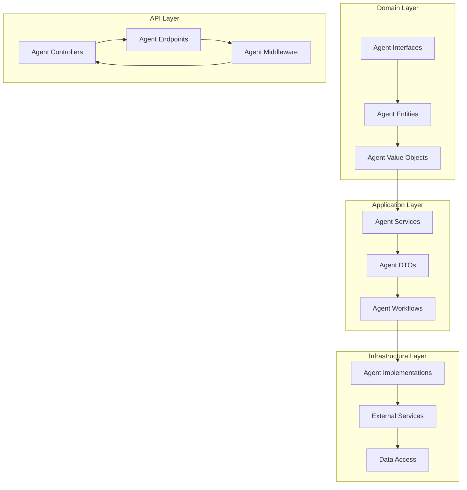
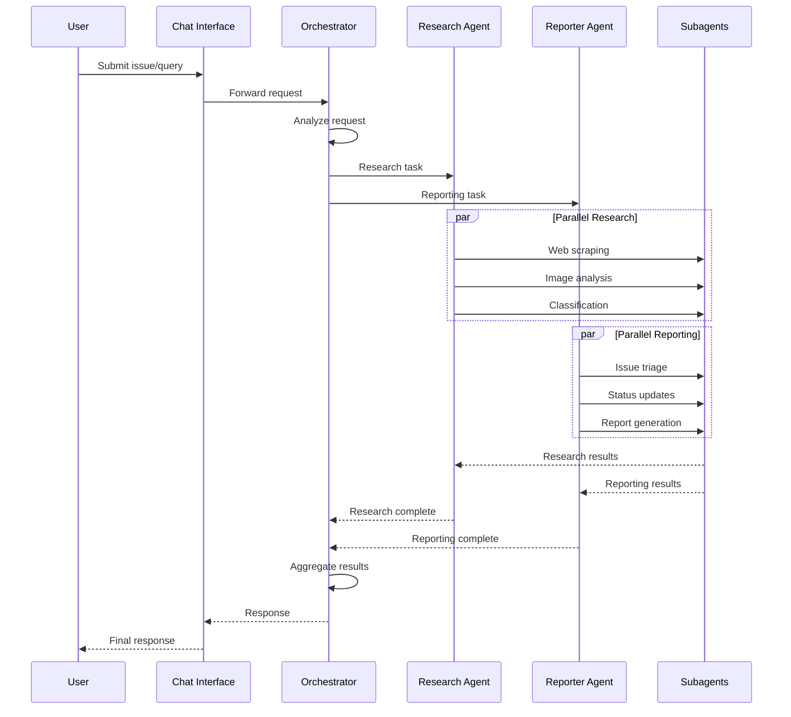
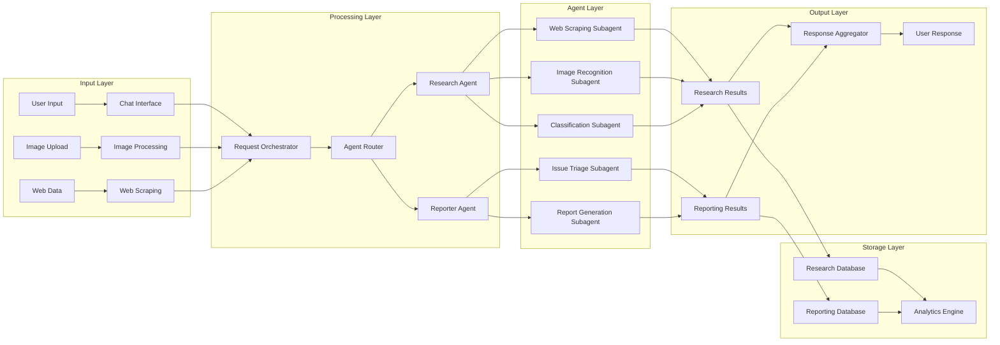

# UrbanAI Custom Agents Architecture

## Executive Summary

The UrbanAI Custom Agents Architecture represents a sophisticated multi-agent system designed to enhance the platform's capabilities through specialized AI agents, subagents, and integration patterns. This architecture enables the platform to provide intelligent assistance for municipal operators, citizens, and administrators through coordinated agent workflows, research capabilities, and automated reporting systems.

### Architecture Overview

The custom agents system is built on a hierarchical architecture with clear separation of concerns:

- **Primary Agents**: High-level agents responsible for major functional areas (Research Agent, Reporter Agent)
- **Specialized Subagents**: Focused agents with specific capabilities and expertise areas
- **Integration Layer**: Connects agents with the existing UrbanAI Clean Architecture
- **AI Chat System**: Provides real-time conversational AI assistance for users
- **Workflow Orchestration**: Coordinates multi-agent workflows and task distribution

### Key Benefits

- **Enhanced User Experience**: Intelligent assistance for issue reporting, triage, and resolution
- **Automated Research**: Web scraping, image recognition, and data analysis capabilities
- **Scalable Architecture**: Modular design that grows with platform requirements
- **Integration-First**: Seamless integration with existing Clean Architecture patterns
- **Cost-Optimized**: Designed to work within MVP budget constraints while providing enterprise capabilities

## Architecture Components

### 1. Primary Agent Layer

#### Research Agent
The Research Agent serves as the platform's intelligence gathering and analysis engine, responsible for:

- **Web Scraping**: Automated collection of relevant information from municipal websites, regulations, and news sources
- **Image Analysis**: Computer vision capabilities for analyzing uploaded images, identifying issues, and categorizing problems
- **Data Classification**: Intelligent categorization of urban issues based on type, severity, and location
- **Regulatory Research**: Automatic research of relevant municipal codes, regulations, and compliance requirements
- **Trend Analysis**: Identification of emerging patterns and trends in urban issues

#### Reporter Agent
The Reporter Agent focuses on issue management and communication:

- **Issue Triage**: Automatic classification and prioritization of reported issues
- **Status Updates**: Intelligent status communication to citizens and stakeholders
- **Report Generation**: Automated creation of summary reports and analytics
- **Notification Management**: Coordinated communication across multiple channels
- **Escalation Handling**: Intelligent escalation of critical issues to appropriate authorities

### 2. Specialized Subagent Network

#### Web Scraping Subagent
- **Specialized Crawling**: Focused on municipal websites, government portals, and regulatory sites
- **Content Extraction**: Intelligent extraction of relevant information from unstructured content
- **Change Detection**: Monitoring for updates to regulations, procedures, and policies
- **Compliance Validation**: Ensuring scraped content meets legal and ethical standards

#### Image Recognition Subagent
- **Computer Vision**: Advanced image analysis for identifying urban issues
- **Object Detection**: Recognition of specific problems (potholes, graffiti, damaged infrastructure)
- **Severity Assessment**: Automated determination of issue severity based on visual analysis
- **Geolocation**: Location mapping and area identification from image metadata

#### Classification Subagent
- **Machine Learning**: Intelligent categorization of issues using ML models
- **Priority Assignment**: Automated priority scoring based on impact and urgency
- **Routing Logic**: Intelligent routing to appropriate departments or personnel
- **Duplicate Detection**: Identification and merging of duplicate reports

#### Municipal Discovery Subagent
- **Service Mapping**: Discovery and mapping of municipal services and departments
- **Process Analysis**: Understanding of municipal workflows and procedures
- **Contact Information**: Maintenance of up-to-date contact information for authorities
- **Integration Points**: Identification of integration opportunities with existing systems

### 3. AI Chat Integration

#### Real-time Assistance
- **Conversational Interface**: Natural language interaction with users
- **Context Awareness**: Understanding of user context and issue history
- **Multi-turn Dialogs**: Complex conversations requiring multiple interactions
- **Personalization**: Tailored responses based on user role and history

#### Agent Coordination
- **Workflow Orchestration**: Coordinating multiple agents to handle complex requests
- **Task Distribution**: Intelligent distribution of tasks among specialized agents
- **Result Aggregation**: Combining results from multiple agents into coherent responses
- **Error Handling**: Graceful handling of agent failures and fallback strategies

## Technical Architecture

### System Design Patterns

#### Clean Architecture Integration
The custom agents system follows Clean Architecture principles:



#### Agent Communication Patterns



### Data Flow Architecture



## Integration with UrbanAI Platform

### Clean Architecture Alignment

The custom agents system integrates seamlessly with UrbanAI's existing Clean Architecture:

#### Domain Layer Extensions
- **Agent Entities**: Core agent definitions and business rules
- **Agent Value Objects**: Agent-specific data types and constraints
- **Agent Interfaces**: Contracts for agent operations and workflows

#### Application Layer Services
- **Agent Orchestration**: Coordination of agent workflows and task distribution
- **Agent Communication**: Message passing and result aggregation
- **Agent Lifecycle**: Agent initialization, execution, and termination

#### Infrastructure Layer Implementations
- **Agent Providers**: Concrete implementations of agent interfaces
- **External Service Integration**: Connections to web services, APIs, and databases
- **Agent Persistence**: Storage of agent state, results, and history

### API Layer Integration

#### Agent Endpoints
```
/api/v1/agents/chat           # Real-time chat interface
/api/v1/agents/research       # Research agent operations
/api/v1/agents/report         # Reporter agent operations
/api/v1/agents/workflows      # Workflow management
/api/v1/agents/analytics      # Agent performance analytics
```

#### Agent Management APIs
```
/api/v1/agents/config         # Agent configuration
/api/v1/agents/status         # Agent status monitoring
/api/v1/agents/logs          # Agent activity logs
/api/v1/agents/metrics        # Performance metrics
```

## Technology Stack

### Core Technologies
- **.NET 9**: Agent framework and orchestration layer
- **ASP.NET Core**: API endpoints and middleware
- **Entity Framework Core**: Agent state and result persistence
- **Azure Functions**: Serverless agent execution (optional scaling path)

### AI and ML Services
- **Azure OpenAI**: Conversational AI and natural language processing
- **Azure Computer Vision**: Image analysis and object detection
- **Azure Machine Learning**: Custom model training and deployment
- **Azure Cognitive Services**: Text analytics and sentiment analysis

### Integration Services
- **Azure Service Bus**: Agent communication and message passing
- **Azure Event Grid**: Event-driven agent workflows
- **Azure API Management**: API gateway and rate limiting
- **Azure Monitor**: Agent performance monitoring and logging

## Security Architecture

### Authentication and Authorization
- **Azure AD**: Identity management and authentication
- **OAuth 2.0**: Authorization for agent operations
- **Role-Based Access Control**: Granular permissions for agent access
- **JWT Tokens**: Secure communication between components

### Data Protection
- **Encryption at Rest**: Azure SQL and Cosmos DB encryption
- **Encryption in Transit**: TLS 1.3 for all communications
- **Data Masking**: Sensitive data protection in agent responses
- **Audit Logging**: Comprehensive audit trail for all agent operations

### Compliance and Governance
- **GDPR Compliance**: Data handling and privacy protection
- **Municipal Data Standards**: Compliance with government data regulations
- **Ethical AI Guidelines**: Responsible AI development and deployment
- **Transparency**: Clear documentation of agent capabilities and limitations

## Performance and Scalability

### Performance Characteristics
- **Response Time**: < 2 seconds for simple agent interactions
- **Throughput**: 100+ concurrent agent operations
- **Availability**: 99.9% uptime for critical agent services
- **Scalability**: Horizontal scaling with Azure Functions and Container Apps

### Cost Optimization
- **MVP Phase**: $4.90/month using Azure Free Tier and consumption-based pricing
- **Scaling Phase**: $25-50/month with enhanced capabilities
- **Enterprise Phase**: Custom pricing based on usage and scale

## Monitoring and Observability

### Metrics Collection
- **Agent Performance**: Response times, success rates, error rates
- **Resource Utilization**: CPU, memory, network usage
- **Business Metrics**: Issue resolution time, user satisfaction, agent utilization
- **Cost Tracking**: Azure service costs and agent operation costs

### Alerting and Notifications
- **Performance Alerts**: Threshold-based alerts for performance degradation
- **Error Alerts**: Immediate notification of agent failures
- **Cost Alerts**: Budget monitoring and cost optimization recommendations
- **Security Alerts**: Suspicious activity detection and response

## Deployment Architecture

### Environment Strategy
- **Development**: Local development with agent simulators
- **Staging**: Azure staging environment with production-like configuration
- **Production**: Azure production environment with high availability
- **Canary**: Gradual rollout of new agent capabilities

### Deployment Pipeline
- **CI/CD**: GitHub Actions for automated deployment
- **Infrastructure as Code**: Bicep templates for Azure resources
- **Configuration Management**: Azure App Configuration for agent settings
- **Rollback Strategy**: Automated rollback for failed deployments

## Future Enhancements

### Advanced Agent Capabilities
- **Multi-Modal Agents**: Agents capable of processing text, images, and video
- **Autonomous Agents**: Self-directed agents with goal-oriented behavior
- **Collaborative Agents**: Agents that work together to solve complex problems
- **Learning Agents**: Agents that improve performance through experience

### Integration Expansion
- **External System Integration**: Connections to existing municipal systems
- **Third-Party Services**: Integration with external APIs and services
- **IoT Integration**: Real-time data from urban sensors and devices
- **Blockchain Integration**: Secure and transparent record-keeping

## Conclusion

The UrbanAI Custom Agents Architecture provides a robust, scalable, and cost-effective foundation for intelligent urban issue management. By leveraging Clean Architecture principles, modern AI services, and cloud-native technologies, the system delivers enhanced capabilities while maintaining alignment with the platform's overall architecture and business goals.

The modular design ensures that the system can evolve with changing requirements while maintaining stability, security, and performance. The integration patterns ensure seamless operation with existing UrbanAI components while providing clear paths for future enhancement and scaling.

This architecture serves as the foundation for transforming urban issue management through intelligent automation, research capabilities, and user-centric design, ultimately improving the quality of urban services and citizen satisfaction.