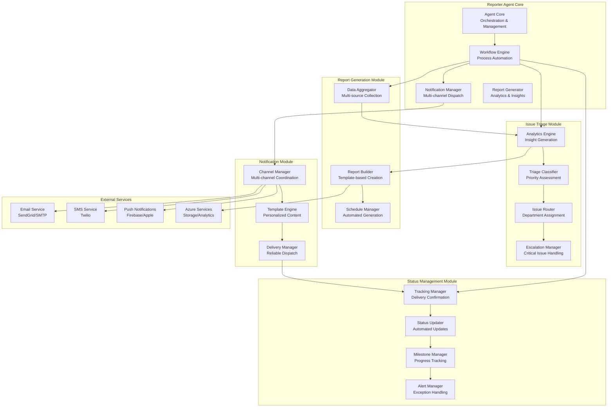
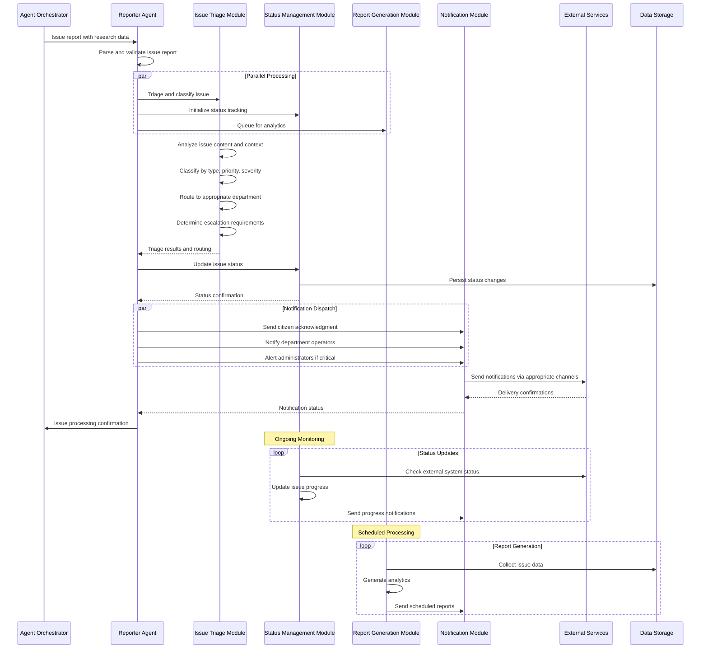

# Reporter Agent Specification

## Executive Summary

The Reporter Agent is a specialized AI agent responsible for issue management, communication, and reporting within the UrbanAI platform. It serves as the primary communication hub between citizens, municipal operators, and administrators, handling issue triage, status updates, report generation, and notification management with intelligence and automation.

## Agent Overview

### Core Purpose
The Reporter Agent transforms raw issue reports into structured, actionable information and facilitates transparent communication throughout the issue lifecycle. It ensures that citizens receive timely updates, operators have efficient workflows, and administrators have comprehensive insights into urban issue management.

### Key Capabilities
- **Intelligent Issue Triage**: Automated classification, prioritization, and routing of issues
- **Status Communication**: Proactive status updates and milestone notifications
- **Automated Reporting**: Dynamic report generation with analytics and insights
- **Multi-channel Notifications**: Coordinated communication across email, SMS, and in-app notifications
- **Escalation Management**: Intelligent escalation of critical issues to appropriate authorities

### Success Metrics
- **Response Time**: < 1 hour for initial issue acknowledgment
- **Resolution Rate**: > 85% of issues resolved within SLA
- **Citizen Satisfaction**: > 4.5/5 rating for communication quality
- **Operational Efficiency**: > 50% reduction in manual reporting overhead

## Technical Architecture

### System Design



### Communication Protocol



## Module Specifications

### Issue Triage Module

#### Responsibilities
- Analyze incoming issue reports for content and context
- Classify issues by type, category, priority, and severity
- Route issues to appropriate municipal departments
- Identify and handle critical issues requiring immediate escalation

#### Technical Implementation
```csharp
// Domain Interface
public interface IIssueTriageService
{
    Task<TriageResult> TriageIssueAsync(IssueTriageRequest request);
    Task<DepartmentAssignment> AssignToDepartmentAsync(TriageResult triage);
    Task<EscalationDecision> DetermineEscalationAsync(TriageResult triage);
    Task<IssueWorkflow> CreateWorkflowAsync(TriageResult triage);
}

// Application Service
public class IssueTriageService : IIssueTriageService
{
    private readonly IIssueAnalyzer _analyzer;
    private readonly ITriageClassifier _classifier;
    private readonly IDepartmentRouter _router;
    private readonly IEscalationManager _escalationManager;

    public async Task<TriageResult> TriageIssueAsync(IssueTriageRequest request)
    {
        var analysis = await _analyzer.AnalyzeAsync(request);
        var classification = await _classifier.ClassifyAsync(analysis);
        var routing = await _router.RouteAsync(classification);
        var escalation = await _escalationManager.DetermineEscalationAsync(classification);

        return new TriageResult
        {
            IssueId = request.IssueId,
            Analysis = analysis,
            Classification = classification,
            Routing = routing,
            Escalation = escalation,
            ProcessedAt = DateTime.UtcNow,
            ProcessedBy = "ReporterAgent"
        };
    }
}
```

#### Configuration Parameters
```json
{
  "IssueTriage": {
    "Classification": {
      "ConfidenceThreshold": 0.8,
      "MaxProcessingTime": "00:05:00",
      "RetryAttempts": 3,
      "ModelVersion": "v2.1"
    },
    "Routing": {
      "DefaultDepartment": "GeneralServices",
      "EmergencyThreshold": 0.9,
      "AutoAssignEnabled": true,
      "LoadBalancingEnabled": true
    },
    "Escalation": {
      "CriticalResponseTime": "00:15:00",
      "HighResponseTime": "01:00:00",
      "EscalationPaths": ["Supervisor", "Manager", "Director"],
      "AutoEscalateEnabled": true
    }
  }
}
```

### Status Management Module

#### Responsibilities
- Track issue status throughout the lifecycle
- Provide real-time status updates to stakeholders
- Manage milestones and progress tracking
- Handle status changes and exceptions

#### Technical Implementation
```csharp
// Domain Interface
public interface IStatusManagementService
{
    Task<StatusUpdateResult> UpdateStatusAsync(StatusUpdateRequest request);
    Task<IEnumerable<StatusEvent>> GetStatusHistoryAsync(string issueId);
    Task<MilestoneProgress> TrackMilestonesAsync(string issueId);
    Task<AlertResult> HandleStatusAlertsAsync(string issueId);
}

// Application Service
public class StatusManagementService : IStatusManagementService
{
    private readonly IStatusTracker _tracker;
    private readonly IMilestoneManager _milestoneManager;
    private readonly IAlertManager _alertManager;
    private readonly IExternalSystemConnector _externalConnector;

    public async Task<StatusUpdateResult> UpdateStatusAsync(StatusUpdateRequest request)
    {
        var currentStatus = await _tracker.GetCurrentStatusAsync(request.IssueId);
        var validation = ValidateStatusTransition(currentStatus, request.NewStatus);

        if (!validation.IsValid)
        {
            return new StatusUpdateResult
            {
                Success = false,
                Errors = validation.Errors,
                CurrentStatus = currentStatus
            };
        }

        var statusEvent = new StatusEvent
        {
            IssueId = request.IssueId,
            PreviousStatus = currentStatus,
            NewStatus = request.NewStatus,
            UpdatedBy = request.UpdatedBy,
            Timestamp = DateTime.UtcNow,
            Comments = request.Comments,
            Metadata = request.Metadata
        };

        await _tracker.RecordStatusEventAsync(statusEvent);
        await _milestoneManager.UpdateMilestonesAsync(request.IssueId, request.NewStatus);
        await _alertManager.ProcessStatusAlertsAsync(statusEvent);

        // Sync with external systems
        if (request.SyncExternal)
        {
            await _externalConnector.SyncStatusAsync(statusEvent);
        }

        return new StatusUpdateResult
        {
            Success = true,
            NewStatus = request.NewStatus,
            Timestamp = DateTime.UtcNow,
            EventId = statusEvent.EventId
        };
    }
}
```

### Report Generation Module

#### Responsibilities
- Generate automated reports with analytics and insights
- Provide scheduled and on-demand reporting capabilities
- Create visualizations and dashboards for stakeholders
- Support multiple report formats and delivery methods

#### Technical Implementation
```csharp
// Domain Interface
public interface IReportGenerationService
{
    Task<ReportResult> GenerateReportAsync(ReportRequest request);
    Task<IEnumerable<ReportSchedule>> GetScheduledReportsAsync();
    Task<ReportDeliveryResult> DeliverReportAsync(string reportId, DeliveryRequest delivery);
    Task<ReportAnalytics> GetReportAnalyticsAsync(string reportId);
}

// Application Service
public class ReportGenerationService : IReportGenerationService
{
    private readonly IReportDataCollector _dataCollector;
    private readonly IReportAnalyticsEngine _analyticsEngine;
    private readonly IReportTemplateEngine _templateEngine;
    private readonly IReportScheduler _scheduler;

    public async Task<ReportResult> GenerateReportAsync(ReportRequest request)
    {
        var data = await _dataCollector.CollectDataAsync(request.DataSource);
        var analytics = await _analyticsEngine.GenerateAnalyticsAsync(data, request.AnalyticsConfig);
        var content = await _templateEngine.GenerateContentAsync(analytics, request.Template);

        var report = new GeneratedReport
        {
            Id = Guid.NewGuid().ToString(),
            Title = request.Title,
            Type = request.Type,
            Content = content,
            Analytics = analytics,
            GeneratedAt = DateTime.UtcNow,
            GeneratedBy = "ReporterAgent",
            Format = request.Format,
            Metadata = request.Metadata
        };

        await _reportRepository.SaveAsync(report);

        if (request.ScheduleDelivery)
        {
            await _scheduler.ScheduleDeliveryAsync(report, request.DeliveryConfig);
        }

        return new ReportResult
        {
            ReportId = report.Id,
            Success = true,
            GeneratedAt = DateTime.UtcNow,
            DownloadUrl = GenerateDownloadUrl(report.Id),
            Metadata = report.Metadata
        };
    }
}
```

### Notification Module

#### Responsibilities
- Manage multi-channel notification delivery
- Personalize notification content based on user preferences
- Track notification delivery and engagement
- Handle notification preferences and opt-outs

#### Technical Implementation
```csharp
// Domain Interface
public interface INotificationService
{
    Task<NotificationResult> SendNotificationAsync(NotificationRequest request);
    Task<IEnumerable<NotificationPreference>> GetUserPreferencesAsync(string userId);
    Task<NotificationTrackingResult> TrackNotificationAsync(string notificationId);
    Task UpdatePreferencesAsync(string userId, NotificationPreferences preferences);
}

// Application Service
public class NotificationService : INotificationService
{
    private readonly INotificationChannelManager _channelManager;
    private readonly INotificationTemplateEngine _templateEngine;
    private readonly INotificationTracker _tracker;
    private readonly IUserPreferenceService _preferenceService;

    public async Task<NotificationResult> SendNotificationAsync(NotificationRequest request)
    {
        var preferences = await _preferenceService.GetUserPreferencesAsync(request.UserId);
        var channels = DeterminePreferredChannels(request.Type, preferences);

        var notificationTasks = channels.Select(async channel =>
        {
            var content = await _templateEngine.GenerateContentAsync(request, channel);
            var deliveryResult = await _channelManager.SendAsync(channel, content);

            await _tracker.TrackDeliveryAsync(new NotificationTracking
            {
                NotificationId = request.Id,
                Channel = channel,
                UserId = request.UserId,
                DeliveryResult = deliveryResult,
                Timestamp = DateTime.UtcNow
            });

            return new ChannelDeliveryResult
            {
                Channel = channel,
                Success = deliveryResult.Success,
                MessageId = deliveryResult.MessageId,
                Timestamp = DateTime.UtcNow
            };
        });

        var deliveryResults = await Task.WhenAll(notificationTasks);

        return new NotificationResult
        {
            NotificationId = request.Id,
            Success = deliveryResults.Any(r => r.Success),
            DeliveredChannels = deliveryResults.Where(r => r.Success).Select(r => r.Channel),
            FailedChannels = deliveryResults.Where(r => !r.Success).Select(r => r.Channel),
            Timestamp = DateTime.UtcNow,
            Metadata = request.Metadata
        };
    }
}
```

## Data Models

### Core Entities

```csharp
// Issue Report
public class IssueReport
{
    public string Id { get; set; }
    public string ReporterId { get; set; }
    public string Title { get; set; }
    public string Description { get; set; }
    public IssueType Type { get; set; }
    public IssueCategory Category { get; set; }
    public PriorityLevel Priority { get; set; }
    public SeverityLevel Severity { get; set; }
    public LocationInfo Location { get; set; }
    public IEnumerable<string> Attachments { get; set; }
    public Dictionary<string, string> Metadata { get; set; }
    public DateTime CreatedAt { get; set; }
    public DateTime? UpdatedAt { get; set; }
}

// Triage Result
public class TriageResult
{
    public string IssueId { get; set; }
    public IssueAnalysis Analysis { get; set; }
    public IssueClassification Classification { get; set; }
    public DepartmentRouting Routing { get; set; }
    public EscalationDecision Escalation { get; set; }
    public DateTime ProcessedAt { get; set; }
    public string ProcessedBy { get; set; }
}

// Status Event
public class StatusEvent
{
    public string EventId { get; set; }
    public string IssueId { get; set; }
    public IssueStatus PreviousStatus { get; set; }
    public IssueStatus NewStatus { get; set; }
    public string UpdatedBy { get; set; }
    public DateTime Timestamp { get; set; }
    public string Comments { get; set; }
    public Dictionary<string, object> Metadata { get; set; }
}

// Generated Report
public class GeneratedReport
{
    public string Id { get; set; }
    public string Title { get; set; }
    public ReportType Type { get; set; }
    public ReportContent Content { get; set; }
    public ReportAnalytics Analytics { get; set; }
    public DateTime GeneratedAt { get; set; }
    public string GeneratedBy { get; set; }
    public ReportFormat Format { get; set; }
    public Dictionary<string, object> Metadata { get; set; }
}
```

## API Specifications

### Endpoints

```yaml
/api/v1/reporter/issues:
  post:
    summary: Create and triage new issue report
    description: Submit new urban issue for processing and triage
    requestBody:
      required: true
      content:
        application/json:
          schema:
            $ref: '#/components/schemas/IssueReportRequest'
    responses:
      '201':
        description: Issue created and triaged successfully
        content:
          application/json:
            schema:
              $ref: '#/components/schemas/IssueReportResponse'
      '400':
        description: Invalid issue report format

/api/v1/reporter/status:
  put:
    summary: Update issue status
    description: Update issue status and trigger notifications
    parameters:
      - name: issueId
        in: path
        required: true
        schema:
          type: string
    requestBody:
      required: true
      content:
        application/json:
          schema:
            $ref: '#/components/schemas/StatusUpdateRequest'
    responses:
      '200':
        description: Status updated successfully

/api/v1/reporter/reports:
  get:
    summary: Get reports
    description: Retrieve generated reports
    parameters:
      - name: type
        in: query
        required: false
        schema:
          type: string
      - name: dateRange
        in: query
        required: false
        schema:
          type: string
    responses:
      '200':
        description: Reports retrieved successfully

/api/v1/reporter/notifications:
  post:
    summary: Send notifications
    description: Send notifications to stakeholders
    requestBody:
      required: true
      content:
        application/json:
          schema:
            $ref: '#/components/schemas/NotificationRequest'
    responses:
      '200':
        description: Notifications sent successfully
```

## Performance Optimization

### Caching Strategy
- **Status Cache**: Cache issue status for fast retrieval (5-minute TTL)
- **Report Cache**: Cache generated reports for repeated access (1-hour TTL)
- **Template Cache**: Cache notification templates for fast generation (24-hour TTL)
- **User Preference Cache**: Cache user notification preferences (1-hour TTL)

### Scalability Considerations
- **Queue-based Processing**: Asynchronous processing of notifications and reports
- **Batch Operations**: Efficient batch processing of status updates
- **Database Optimization**: Optimized queries for issue tracking and reporting
- **Connection Pooling**: Efficient management of external service connections

## Security and Compliance

### Data Protection
- **Encryption**: Encrypt sensitive issue data at rest and in transit
- **Access Control**: Role-based access to issue information
- **Audit Logging**: Complete audit trail of all status changes
- **Data Retention**: Configurable retention policies for issue data

### Compliance Considerations
- **GDPR Compliance**: Handle personal data according to regulations
- **Accessibility**: Ensure notifications are accessible to all users
- **Privacy**: Protect user privacy in issue reports
- **Transparency**: Clear communication about data usage

## Monitoring and Alerting

### Key Metrics
- **Triage Accuracy**: Accuracy of automated issue classification
- **Response Time**: Time to acknowledge and process issues
- **Notification Delivery**: Success rate of notification delivery
- **Report Generation**: Time and success rate of report generation

### Alert Thresholds
- **High Error Rate**: > 5% error rate over 5 minutes
- **Slow Processing**: > 30 seconds for status updates
- **Notification Failures**: > 10% notification failure rate
- **System Overload**: > 80% resource utilization

## Future Enhancements

### Advanced Capabilities
- **Predictive Analytics**: Predict issue resolution times and outcomes
- **Natural Language Processing**: Advanced understanding of issue descriptions
- **Automated Resolution**: Self-service resolution for common issues
- **Multi-language Support**: Support for multiple languages in notifications

### Integration Expansion
- **Social Media Integration**: Issue reporting from social media platforms
- **IoT Integration**: Automated issue detection from sensors
- **External System Integration**: Integration with existing municipal systems
- **Citizen Portal Integration**: Seamless user experience across platforms

## Conclusion

The Reporter Agent specification provides a comprehensive foundation for implementing intelligent issue management and communication capabilities within the UrbanAI platform. By leveraging modern communication services, following Clean Architecture principles, and maintaining focus on municipal use cases, the agent delivers powerful reporting capabilities while ensuring security, performance, and scalability.

This specification serves as the blueprint for implementation teams, providing detailed technical guidance while allowing flexibility for evolving requirements and technological advancements.