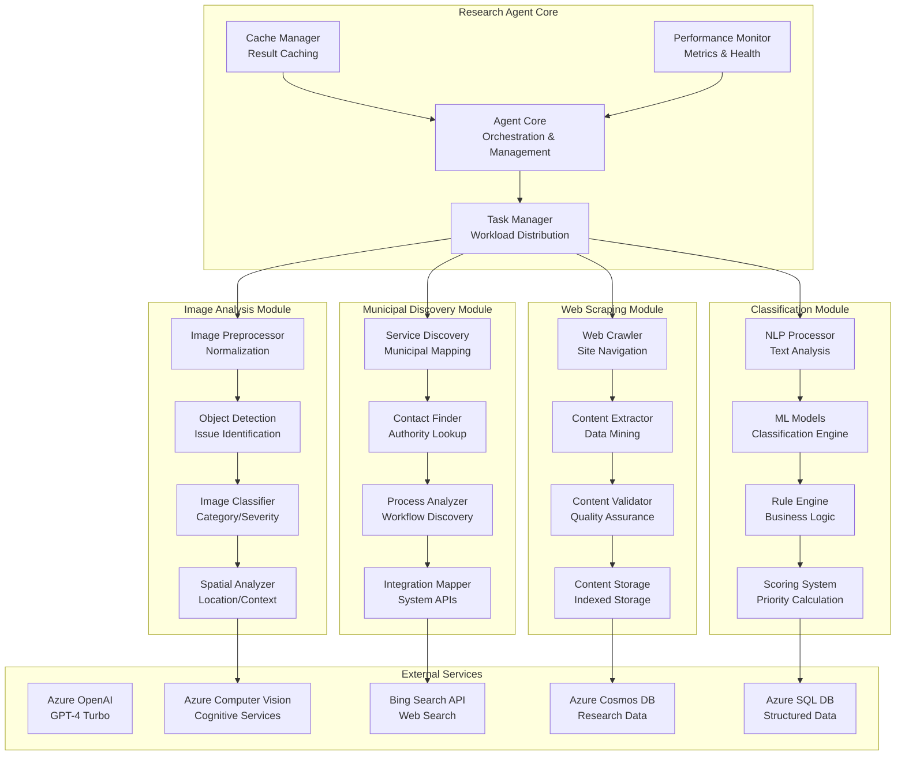
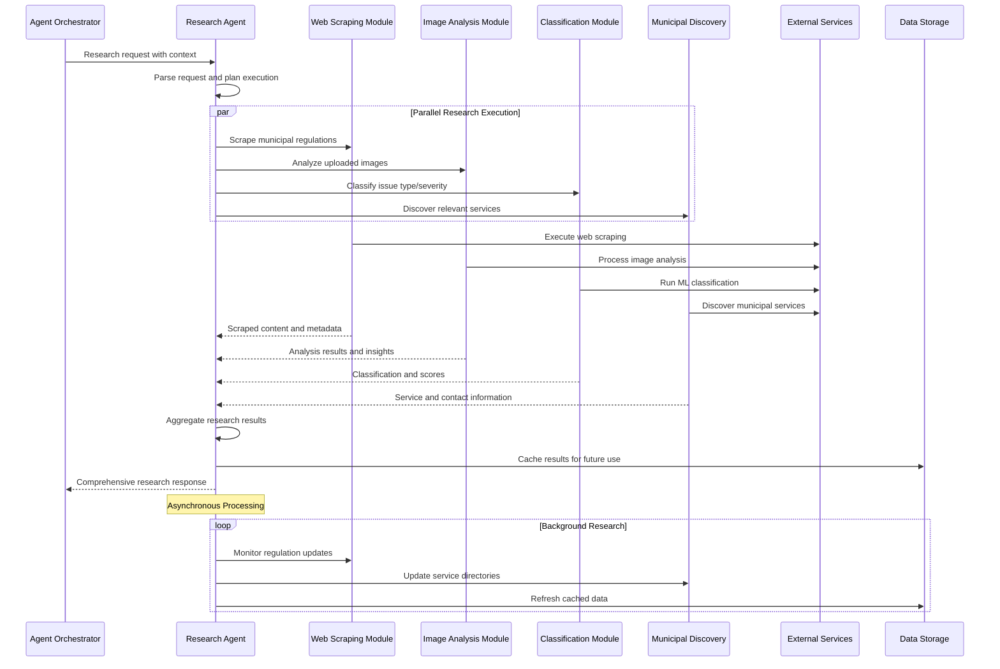

# Research Agent Specification

## Executive Summary

The Research Agent is a specialized AI agent responsible for intelligence gathering, data analysis, and information processing within the UrbanAI platform. It serves as the primary research engine for municipal issue management, providing automated web scraping, image analysis, classification, and regulatory research capabilities to support citizens, operators, and administrators.

## Agent Overview

### Core Purpose
The Research Agent transforms raw data (text, images, web content) into actionable intelligence for urban issue management. It processes unstructured information from multiple sources to identify patterns, extract insights, and provide contextual understanding of urban issues.

### Key Capabilities
- **Automated Web Scraping**: Intelligent collection of municipal regulations, news, and service information
- **Advanced Image Analysis**: Computer vision for identifying, categorizing, and assessing urban issues from images
- **Intelligent Classification**: ML-powered categorization of issues by type, severity, and location
- **Regulatory Research**: Automatic identification of relevant laws, codes, and compliance requirements
- **Trend Analysis**: Pattern recognition and trend identification in urban issue data

### Success Metrics
- **Accuracy**: > 95% accuracy in image classification and issue identification
- **Coverage**: Comprehensive coverage of 100+ municipal websites and regulatory sources
- **Speed**: < 5 seconds for image analysis, < 30 seconds for web research tasks
- **Reliability**: 99.5% uptime for critical research functions

## Technical Architecture

### System Design



### Communication Protocol



## Module Specifications

### Web Scraping Module

#### Responsibilities
- Crawl municipal websites, government portals, and regulatory databases
- Extract structured and unstructured content from web pages
- Validate content quality and relevance
- Store and index scraped content for efficient retrieval

#### Technical Implementation
```csharp
// Domain Interface
public interface IWebScrapingService
{
    Task<ScrapingResult> ScrapeWebsiteAsync(ScrapingRequest request);
    Task<IEnumerable<RegulationContent>> FindRegulationsAsync(RegulationQuery query);
    Task<bool> IsContentUpdatedAsync(string url, DateTime lastCheck);
    Task<MunicipalService> DiscoverMunicipalServicesAsync(string municipality);
}

// Application Service
public class WebScrapingService : IWebScrapingService
{
    private readonly IWebCrawler _crawler;
    private readonly IContentExtractor _extractor;
    private readonly IContentValidator _validator;
    private readonly IResearchCache _cache;

    public async Task<ScrapingResult> ScrapeWebsiteAsync(ScrapingRequest request)
    {
        // Check cache first
        var cached = await _cache.GetCachedResultAsync(request.Url);
        if (cached != null && !await IsContentUpdatedAsync(request.Url, cached.Timestamp))
        {
            return cached;
        }

        // Execute scraping
        var crawledContent = await _crawler.CrawlAsync(request.Url, request.Depth);
        var extractedContent = await _extractor.ExtractAsync(crawledContent);
        var validatedContent = await _validator.ValidateAsync(extractedContent);

        // Cache results
        await _cache.CacheResultAsync(validatedContent);

        return validatedContent;
    }
}
```

#### Configuration Parameters
```json
{
  "WebScraping": {
    "MaxConcurrentRequests": 10,
    "RequestTimeout": "00:00:30",
    "UserAgent": "UrbanAI-Research-Agent/1.0",
    "RateLimitDelay": "00:00:01",
    "MaxRetryAttempts": 3,
    "AllowedDomains": [
      "*.gov",
      "*.municipality.*",
      "*.city.*",
      "*.urban.*"
    ],
    "ExcludedPaths": [
      "/admin",
      "/login",
      "/private"
    ]
  }
}
```

### Image Analysis Module

#### Responsibilities
- Process uploaded images to identify urban issues
- Detect and classify objects, infrastructure problems, and environmental concerns
- Assess issue severity based on visual analysis
- Extract location and contextual information from images

#### Technical Implementation
```csharp
// Domain Interface
public interface IImageAnalysisService
{
    Task<ImageAnalysisResult> AnalyzeImageAsync(ImageAnalysisRequest request);
    Task<IEnumerable<DetectedIssue>> DetectIssuesAsync(Stream imageStream);
    Task<SeverityAssessment> AssessSeverityAsync(DetectedIssue issue);
    Task<LocationInfo> ExtractLocationAsync(ImageMetadata metadata);
}

// Application Service
public class ImageAnalysisService : IImageAnalysisService
{
    private readonly IComputerVisionClient _visionClient;
    private readonly IObjectDetectionModel _detectionModel;
    private readonly ISeverityAssessmentModel _severityModel;
    private readonly ILocationExtractor _locationExtractor;

    public async Task<ImageAnalysisResult> AnalyzeImageAsync(ImageAnalysisRequest request)
    {
        var imageStream = await GetImageStreamAsync(request.ImageUrl);
        var detectedObjects = await DetectIssuesAsync(imageStream);

        var analysisTasks = detectedObjects.Select(async obj =>
        {
            var severity = await AssessSeverityAsync(obj);
            var location = await ExtractLocationAsync(request.Metadata);

            return new IssueAnalysis
            {
                Object = obj,
                Severity = severity,
                Location = location,
                Confidence = obj.Confidence
            };
        });

        var analyses = await Task.WhenAll(analysisTasks);

        return new ImageAnalysisResult
        {
            Issues = analyses,
            Summary = GenerateSummary(analyses),
            Recommendations = GenerateRecommendations(analyses)
        };
    }
}
```

### Classification Module

#### Responsibilities
- Classify urban issues by type, category, and priority
- Apply machine learning models for accurate categorization
- Calculate priority scores based on impact and urgency
- Map issues to appropriate municipal departments and services

#### Technical Implementation
```csharp
// Domain Interface
public interface IIssueClassificationService
{
    Task<ClassificationResult> ClassifyIssueAsync(IssueClassificationRequest request);
    Task<PriorityScore> CalculatePriorityAsync(ClassifiedIssue issue);
    Task<DepartmentMapping> MapToDepartmentAsync(ClassifiedIssue issue);
    Task<IEnumerable<string>> SuggestActionsAsync(ClassifiedIssue issue);
}

// Application Service
public class IssueClassificationService : IIssueClassificationService
{
    private readonly IMLClassificationModel _classificationModel;
    private readonly IPriorityCalculator _priorityCalculator;
    private readonly IDepartmentMapper _departmentMapper;
    private readonly IActionRecommender _actionRecommender;

    public async Task<ClassificationResult> ClassifyIssueAsync(IssueClassificationRequest request)
    {
        var textFeatures = await ExtractTextFeaturesAsync(request);
        var imageFeatures = await ExtractImageFeaturesAsync(request);
        var contextFeatures = await ExtractContextFeaturesAsync(request);

        var classification = await _classificationModel.ClassifyAsync(new ClassificationInput
        {
            TextFeatures = textFeatures,
            ImageFeatures = imageFeatures,
            ContextFeatures = contextFeatures
        });

        var priority = await CalculatePriorityAsync(classification);
        var department = await MapToDepartmentAsync(classification);
        var actions = await SuggestActionsAsync(classification);

        return new ClassificationResult
        {
            Classification = classification,
            Priority = priority,
            Department = department,
            RecommendedActions = actions,
            Confidence = classification.Confidence
        };
    }
}
```

### Municipal Discovery Module

#### Responsibilities
- Discover and map municipal services and departments
- Identify contact information and service procedures
- Analyze municipal workflows and processes
- Maintain up-to-date directories of municipal resources

#### Technical Implementation
```csharp
// Domain Interface
public interface IMunicipalDiscoveryService
{
    Task<MunicipalServiceDirectory> DiscoverServicesAsync(string municipality);
    Task<ServiceContact> FindContactAsync(string serviceType, string location);
    Task<ServiceProcess> DiscoverProcessAsync(string serviceId);
    Task<IntegrationPoint> FindIntegrationPointsAsync(string municipality);
}

// Application Service
public class MunicipalDiscoveryService : IMunicipalDiscoveryService
{
    private readonly IWebScrapingService _webScrapingService;
    private readonly IServiceDirectory _serviceDirectory;
    private readonly IProcessAnalyzer _processAnalyzer;
    private readonly IIntegrationMapper _integrationMapper;

    public async Task<MunicipalServiceDirectory> DiscoverServicesAsync(string municipality)
    {
        var services = new List<MunicipalService>();
        var municipalWebsites = await FindMunicipalWebsitesAsync(municipality);

        foreach (var website in municipalWebsites)
        {
            var discoveredServices = await DiscoverServicesFromWebsiteAsync(website);
            services.AddRange(discoveredServices);
        }

        return new MunicipalServiceDirectory
        {
            Municipality = municipality,
            Services = services,
            LastUpdated = DateTime.UtcNow,
            Version = GenerateVersion()
        };
    }
}
```

## Data Models

### Core Entities

```csharp
// Research Request
public class ResearchRequest
{
    public string RequestId { get; set; }
    public string UserId { get; set; }
    public string SessionId { get; set; }
    public string Query { get; set; }
    public IEnumerable<string> ImageUrls { get; set; }
    public Dictionary<string, string> Context { get; set; }
    public DateTime Timestamp { get; set; }
}

// Research Result
public class ResearchResult
{
    public string RequestId { get; set; }
    public bool Success { get; set; }
    public IEnumerable<WebScrapingResult> WebResults { get; set; }
    public IEnumerable<ImageAnalysisResult> ImageResults { get; set; }
    public IEnumerable<ClassificationResult> ClassificationResults { get; set; }
    public IEnumerable<MunicipalService> MunicipalServices { get; set; }
    public TimeSpan ProcessingTime { get; set; }
    public DateTime Timestamp { get; set; }
}

// Web Scraping Result
public class WebScrapingResult
{
    public string Url { get; set; }
    public string Title { get; set; }
    public string Content { get; set; }
    public IEnumerable<ExtractedEntity> Entities { get; set; }
    public DateTime ScrapedAt { get; set; }
    public double RelevanceScore { get; set; }
}

// Image Analysis Result
public class ImageAnalysisResult
{
    public string ImageId { get; set; }
    public IEnumerable<DetectedObject> Objects { get; set; }
    public IEnumerable<DetectedIssue> Issues { get; set; }
    public LocationInfo Location { get; set; }
    public SeverityAssessment Severity { get; set; }
    public double Confidence { get; set; }
}

// Classification Result
public class ClassificationResult
{
    public string IssueId { get; set; }
    public IssueType IssueType { get; set; }
    public IssueCategory Category { get; set; }
    public PriorityLevel Priority { get; set; }
    public double Confidence { get; set; }
    public IEnumerable<string> Tags { get; set; }
    public DepartmentMapping Department { get; set; }
}
```

## API Specifications

### Endpoints

```yaml
/api/v1/research/analyze:
  post:
    summary: Analyze urban issues using research capabilities
    description: Comprehensive analysis of text, images, and context
    requestBody:
      required: true
      content:
        application/json:
          schema:
            $ref: '#/components/schemas/ResearchRequest'
    responses:
      '200':
        description: Research analysis completed successfully
        content:
          application/json:
            schema:
              $ref: '#/components/schemas/ResearchResult'
      '400':
        description: Invalid request format
      '500':
        description: Internal server error

/api/v1/research/scrape:
  post:
    summary: Scrape municipal websites for information
    description: Targeted web scraping for municipal content
    requestBody:
      required: true
      content:
        application/json:
          schema:
            $ref: '#/components/schemas/ScrapingRequest'
    responses:
      '200':
        description: Scraping completed successfully
      '429':
        description: Rate limit exceeded

/api/v1/research/classify:
  post:
    summary: Classify urban issues
    description: ML-powered issue classification
    requestBody:
      required: true
      content:
        application/json:
          schema:
            $ref: '#/components/schemas/ClassificationRequest'
    responses:
      '200':
        description: Classification completed successfully

/api/v1/research/municipal:
  get:
    summary: Get municipal service directory
    description: Retrieve comprehensive municipal service information
    parameters:
      - name: municipality
        in: query
        required: true
        schema:
          type: string
      - name: serviceType
        in: query
        required: false
        schema:
          type: string
    responses:
      '200':
        description: Municipal services retrieved successfully
```

## Performance Optimization

### Caching Strategy
- **Memory Cache**: Frequently accessed research results (5-minute TTL)
- **Redis Cache**: Cross-service caching of research data (1-hour TTL)
- **Database Cache**: Persistent caching of historical research results (24-hour TTL)
- **CDN Cache**: Static resources and public research data (7-day TTL)

### Scalability Considerations
- **Horizontal Scaling**: Multiple agent instances behind load balancer
- **Queue-Based Processing**: Asynchronous processing of long-running research tasks
- **Batch Processing**: Efficient processing of multiple research requests
- **Resource Limits**: Configurable limits on concurrent research operations

## Security and Compliance

### Data Protection
- **Encryption**: All data encrypted at rest and in transit
- **Access Control**: Role-based access to research capabilities
- **Audit Logging**: Complete audit trail of all research operations
- **Data Retention**: Configurable retention policies for research data

### Ethical Considerations
- **Web Scraping Ethics**: Respect robots.txt and rate limits
- **Image Privacy**: Blur faces and license plates in analyzed images
- **Bias Mitigation**: Regular validation of ML models for bias
- **Transparency**: Clear documentation of research capabilities and limitations

## Monitoring and Alerting

### Key Metrics
- **Research Accuracy**: Accuracy of classification and analysis results
- **Processing Time**: Time to complete research tasks
- **Success Rate**: Percentage of successful research operations
- **Resource Utilization**: CPU, memory, and network usage

### Alert Thresholds
- **High Error Rate**: > 5% error rate over 5 minutes
- **Slow Processing**: > 30 seconds for research tasks
- **Service Degradation**: > 10% drop in accuracy metrics
- **Resource Exhaustion**: > 80% CPU or memory usage

## Future Enhancements

### Advanced Capabilities
- **Multi-modal Analysis**: Combined analysis of text, images, and video
- **Real-time Processing**: Stream processing of live urban data
- **Predictive Analytics**: Predictive modeling of urban issues
- **Autonomous Research**: Self-directed research agents

### Integration Expansion
- **IoT Integration**: Real-time data from urban sensors
- **Social Media Integration**: Analysis of social media for issue detection
- **Third-party APIs**: Integration with external data sources
- **Blockchain Integration**: Secure and transparent research records

## Conclusion

The Research Agent specification provides a comprehensive foundation for implementing intelligent research capabilities within the UrbanAI platform. By leveraging modern AI services, following Clean Architecture principles, and maintaining focus on municipal use cases, the agent delivers powerful research capabilities while ensuring security, performance, and scalability.

This specification serves as the blueprint for implementation teams, providing detailed technical guidance while allowing flexibility for evolving requirements and technological advancements.