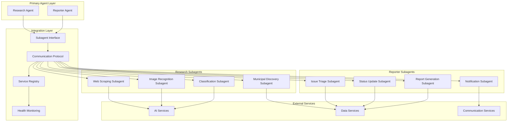
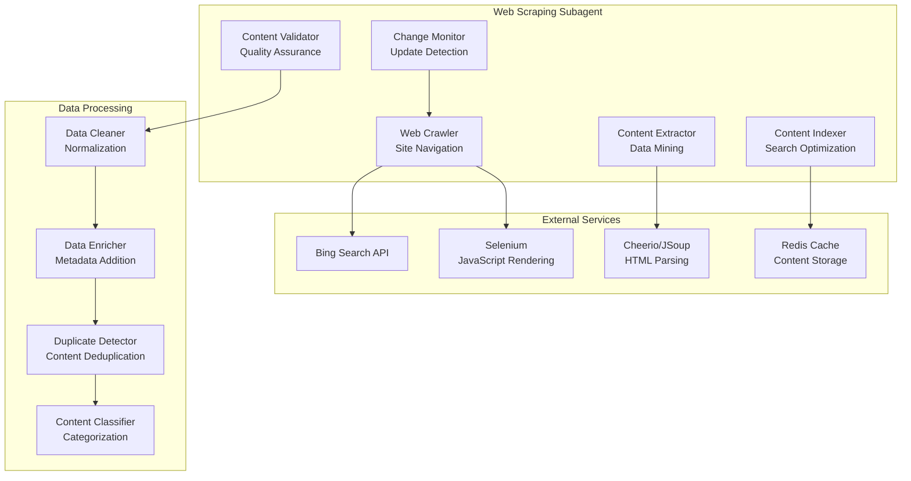
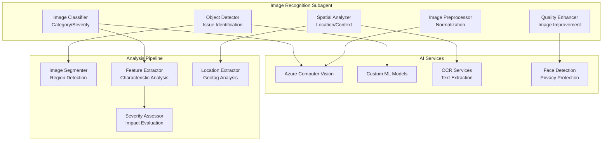
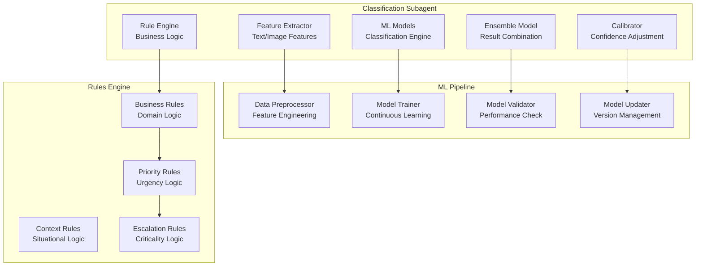
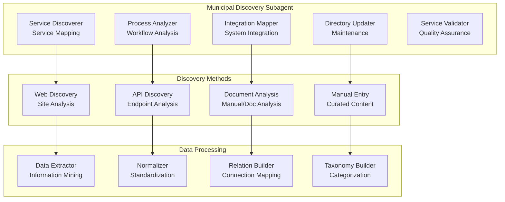

# Subagent Implementations and Integration Patterns

## Executive Summary

The UrbanAI platform utilizes a sophisticated network of specialized subagents that work in coordination with primary agents to deliver comprehensive urban issue management capabilities. Each subagent is designed with a specific focus area, implementing specialized algorithms, external service integrations, and data processing patterns to support the overall agent ecosystem.

## Subagent Architecture Overview

### Design Principles
- **Single Responsibility**: Each subagent focuses on a specific capability
- **Loose Coupling**: Subagents communicate through well-defined interfaces
- **Pluggable Architecture**: Subagents can be added, removed, or updated independently
- **Scalable Design**: Each subagent can scale independently based on demand
- **Fault Tolerance**: Graceful degradation when subagents are unavailable

### Communication Patterns


## Web Scraping Subagent

### Overview
The Web Scraping Subagent specializes in extracting information from municipal websites, government portals, and regulatory databases. It implements advanced crawling algorithms, content extraction patterns, and data validation techniques to ensure high-quality, relevant information for urban issue management.

### Technical Architecture


### Implementation Details
```csharp
public class WebScrapingSubagent : ISubagent
{
    private readonly IWebCrawler _crawler;
    private readonly IContentExtractor _extractor;
    private readonly IContentValidator _validator;
    private readonly IContentIndexer _indexer;
    private readonly ILogger<WebScrapingSubagent> _logger;

    public async Task<SubagentResult> ExecuteAsync(SubagentRequest request)
    {
        try
        {
            var scrapingRequest = JsonConvert.DeserializeObject<WebScrapingRequest>(request.Data);
            var cachedResult = await GetFromCacheAsync(scrapingRequest.Url);

            if (cachedResult != null)
            {
                return new SubagentResult
                {
                    Success = true,
                    Data = JsonConvert.SerializeObject(cachedResult),
                    Metadata = new Dictionary<string, object>
                    {
                        ["Source"] = "Cache",
                        ["CachedAt"] = cachedResult.Timestamp
                    }
                };
            }

            var crawlResult = await _crawler.CrawlAsync(scrapingRequest.Url, scrapingRequest.Options);
            var extractedContent = await _extractor.ExtractAsync(crawlResult);
            var validatedContent = await _validator.ValidateAsync(extractedContent);

            await _indexer.IndexAsync(validatedContent);
            await CacheResultAsync(validatedContent);

            return new SubagentResult
            {
                Success = true,
                Data = JsonConvert.SerializeObject(validatedContent),
                Metadata = new Dictionary<string, object>
                {
                    ["Source"] = "Live",
                    ["PagesCrawled"] = crawlResult.PagesVisited,
                    ["ProcessingTime"] = validatedContent.ProcessingTime
                }
            };
        }
        catch (Exception ex)
        {
            _logger.LogError(ex, "Web scraping failed for request {RequestId}", request.RequestId);
            return new SubagentResult
            {
                Success = false,
                Error = ex.Message,
                Metadata = new Dictionary<string, object>
                {
                    ["ExceptionType"] = ex.GetType().Name,
                    ["StackTrace"] = ex.StackTrace
                }
            };
        }
    }
}
```

### Key Features
- **Intelligent Crawling**: Respect robots.txt, rate limits, and crawl delays
- **Content Validation**: Ensure content relevance and quality
- **Change Detection**: Monitor for updates to previously scraped content
- **Multi-format Support**: Handle HTML, JSON, PDF, and other document formats
- **Geographic Targeting**: Focus on specific municipalities and regions

## Image Recognition Subagent

### Overview
The Image Recognition Subagent leverages computer vision and machine learning to analyze uploaded images, identify urban issues, assess severity levels, and extract contextual information. It integrates with Azure Computer Vision and custom ML models to provide accurate image analysis.

### Technical Architecture


### Implementation Details
```csharp
public class ImageRecognitionSubagent : ISubagent
{
    private readonly IImageProcessor _processor;
    private readonly IObjectDetectionService _detectionService;
    private readonly IImageClassificationService _classificationService;
    private readonly ISpatialAnalysisService _spatialService;
    private readonly ILogger<ImageRecognitionSubagent> _logger;

    public async Task<SubagentResult> ExecuteAsync(SubagentRequest request)
    {
        try
        {
            var imageRequest = JsonConvert.DeserializeObject<ImageAnalysisRequest>(request.Data);
            var imageStream = await GetImageStreamAsync(imageRequest.ImageUrl);

            var processedImage = await _processor.PreprocessAsync(imageStream);
            var detectedObjects = await _detectionService.DetectObjectsAsync(processedImage);
            var classification = await _classificationService.ClassifyAsync(processedImage);
            var spatialAnalysis = await _spatialService.AnalyzeAsync(processedImage);

            var analysisResult = new ImageAnalysisResult
            {
                ImageId = imageRequest.ImageId,
                DetectedObjects = detectedObjects,
                Classification = classification,
                SpatialAnalysis = spatialAnalysis,
                ProcessingTime = DateTime.UtcNow - imageRequest.Timestamp,
                Confidence = CalculateOverallConfidence(detectedObjects, classification)
            };

            return new SubagentResult
            {
                Success = true,
                Data = JsonConvert.SerializeObject(analysisResult),
                Metadata = new Dictionary<string, object>
                {
                    ["ObjectsDetected"] = detectedObjects.Count(),
                    ["ProcessingTimeMs"] = analysisResult.ProcessingTime.TotalMilliseconds,
                    ["ModelVersion"] = classification.ModelVersion
                }
            };
        }
        catch (Exception ex)
        {
            _logger.LogError(ex, "Image analysis failed for request {RequestId}", request.RequestId);
            return new SubagentResult
            {
                Success = false,
                Error = ex.Message,
                Metadata = new Dictionary<string, object>
                {
                    ["ExceptionType"] = ex.GetType().Name,
                    ["ImageId"] = request.Metadata.ContainsKey("ImageId") ? request.Metadata["ImageId"] : null
                }
            };
        }
    }
}
```

### Key Features
- **Multi-object Detection**: Identify multiple issues in a single image
- **Severity Assessment**: Automatically determine issue severity levels
- **Privacy Protection**: Blur faces and license plates automatically
- **Location Extraction**: Extract geographic information from image metadata
- **Quality Enhancement**: Improve low-quality images for better analysis

## Classification Subagent

### Overview
The Classification Subagent implements machine learning algorithms to categorize urban issues by type, priority, and severity. It combines rule-based systems with ML models to provide accurate and consistent classification results.

### Technical Architecture


### Implementation Details
```csharp
public class ClassificationSubagent : ISubagent
{
    private readonly IFeatureExtractor _featureExtractor;
    private readonly IRuleEngine _ruleEngine;
    private readonly IMLClassificationService _mlService;
    private readonly IEnsembleModel _ensembleModel;
    private readonly ILogger<ClassificationSubagent> _logger;

    public async Task<SubagentResult> ExecuteAsync(SubagentRequest request)
    {
        try
        {
            var classificationRequest = JsonConvert.DeserializeObject<ClassificationRequest>(request.Data);
            var features = await _featureExtractor.ExtractFeaturesAsync(classificationRequest);

            var mlResult = await _mlService.ClassifyAsync(features);
            var ruleResult = await _ruleEngine.ApplyRulesAsync(features, classificationRequest.Context);
            var ensembleResult = await _ensembleModel.CombineResultsAsync(mlResult, ruleResult);

            var calibratedResult = await CalibrateResultAsync(ensembleResult, classificationRequest);

            return new SubagentResult
            {
                Success = true,
                Data = JsonConvert.SerializeObject(calibratedResult),
                Metadata = new Dictionary<string, object>
                {
                    ["MLConfidence"] = mlResult.Confidence,
                    ["RuleScore"] = ruleResult.Score,
                    ["FeaturesCount"] = features.Count,
                    ["ProcessingTimeMs"] = (DateTime.UtcNow - classificationRequest.Timestamp).TotalMilliseconds
                }
            };
        }
        catch (Exception ex)
        {
            _logger.LogError(ex, "Classification failed for request {RequestId}", request.RequestId);
            return new SubagentResult
            {
                Success = false,
                Error = ex.Message,
                Metadata = new Dictionary<string, object>
                {
                    ["ExceptionType"] = ex.GetType().Name,
                    ["RequestType"] = request.Type
                }
            };
        }
    }
}
```

### Key Features
- **Hybrid Classification**: Combines ML models with rule-based systems
- **Continuous Learning**: Models improve over time with new data
- **Context Awareness**: Considers situational context in classification
- **Ensemble Methods**: Combines multiple models for improved accuracy
- **Confidence Calibration**: Adjusts confidence scores based on historical performance

## Municipal Discovery Subagent

### Overview
The Municipal Discovery Subagent specializes in discovering and mapping municipal services, departments, and processes. It maintains up-to-date directories of municipal resources and identifies integration opportunities with existing systems.

### Technical Architecture


### Implementation Details
```csharp
public class MunicipalDiscoverySubagent : ISubagent
{
    private readonly IServiceDiscoverer _serviceDiscoverer;
    private readonly IProcessAnalyzer _processAnalyzer;
    private readonly IIntegrationMapper _integrationMapper;
    private readonly IDirectoryUpdater _directoryUpdater;
    private readonly ILogger<MunicipalDiscoverySubagent> _logger;

    public async Task<SubagentResult> ExecuteAsync(SubagentRequest request)
    {
        try
        {
            var discoveryRequest = JsonConvert.DeserializeObject<MunicipalDiscoveryRequest>(request.Data);
            var services = await _serviceDiscoverer.DiscoverServicesAsync(discoveryRequest.Municipality);
            var processes = await _processAnalyzer.AnalyzeProcessesAsync(services);
            var integrationPoints = await _integrationMapper.MapIntegrationsAsync(services, processes);

            var discoveryResult = new MunicipalDiscoveryResult
            {
                Municipality = discoveryRequest.Municipality,
                Services = services,
                Processes = processes,
                IntegrationPoints = integrationPoints,
                DiscoveredAt = DateTime.UtcNow,
                Confidence = CalculateDiscoveryConfidence(services, processes)
            };

            await _directoryUpdater.UpdateDirectoryAsync(discoveryResult);

            return new SubagentResult
            {
                Success = true,
                Data = JsonConvert.SerializeObject(discoveryResult),
                Metadata = new Dictionary<string, object>
                {
                    ["ServicesDiscovered"] = services.Count(),
                    ["ProcessesAnalyzed"] = processes.Count(),
                    ["IntegrationPoints"] = integrationPoints.Count(),
                    ["DiscoveryTimeMs"] = (DateTime.UtcNow - discoveryRequest.Timestamp).TotalMilliseconds
                }
            };
        }
        catch (Exception ex)
        {
            _logger.LogError(ex, "Municipal discovery failed for request {RequestId}", request.RequestId);
            return new SubagentResult
            {
                Success = false,
                Error = ex.Message,
                Metadata = new Dictionary<string, object>
                {
                    ["ExceptionType"] = ex.GetType().Name,
                    ["Municipality"] = request.Metadata.ContainsKey("Municipality") ? request.Metadata["Municipality"] : null
                }
            };
        }
    }
}
```

### Key Features
- **Multi-source Discovery**: Combines automated and manual discovery methods
- **Process Mapping**: Understands municipal workflows and procedures
- **Integration Mapping**: Identifies API and system integration opportunities
- **Continuous Monitoring**: Regular updates to maintain data freshness
- **Quality Validation**: Ensures discovered information is accurate and complete

## Integration Patterns

### Subagent Registry Pattern
```csharp
public interface ISubagentRegistry
{
    Task RegisterSubagentAsync(SubagentInfo subagentInfo);
    Task<ISubagent> GetSubagentAsync(string subagentType);
    Task<IEnumerable<SubagentInfo>> GetAvailableSubagentsAsync();
    Task<bool> IsSubagentAvailableAsync(string subagentType);
}

public class SubagentRegistry : ISubagentRegistry
{
    private readonly Dictionary<string, SubagentInfo> _subagents = new();
    private readonly IServiceProvider _serviceProvider;

    public async Task<ISubagent> GetSubagentAsync(string subagentType)
    {
        if (!_subagents.TryGetValue(subagentType, out var subagentInfo))
        {
            throw new InvalidOperationException($"Subagent {subagentType} not registered");
        }

        if (!await IsSubagentAvailableAsync(subagentType))
        {
            throw new InvalidOperationException($"Subagent {subagentType} is not available");
        }

        return _serviceProvider.GetRequiredService<ISubagent>();
    }
}
```

### Subagent Communication Pattern
```csharp
public interface ISubagentCommunicator
{
    Task<SubagentResult> SendRequestAsync(SubagentRequest request);
    Task<IEnumerable<SubagentResult>> SendRequestsAsync(IEnumerable<SubagentRequest> requests);
    Task<SubagentHealth> GetHealthAsync(string subagentType);
    Task<SubagentMetrics> GetMetricsAsync(string subagentType);
}

public class SubagentCommunicator : ISubagentCommunicator
{
    private readonly ISubagentRegistry _registry;
    private readonly IMessageBus _messageBus;

    public async Task<SubagentResult> SendRequestAsync(SubagentRequest request)
    {
        var subagent = await _registry.GetSubagentAsync(request.Type);
        return await subagent.ExecuteAsync(request);
    }

    public async Task<IEnumerable<SubagentResult>> SendRequestsAsync(IEnumerable<SubagentRequest> requests)
    {
        var tasks = requests.Select(SendRequestAsync);
        return await Task.WhenAll(tasks);
    }
}
```

### Health Monitoring Pattern
```csharp
public interface ISubagentHealthMonitor
{
    Task MonitorSubagentAsync(string subagentType);
    Task<SubagentHealthStatus> GetHealthStatusAsync(string subagentType);
    Task HandleSubagentFailureAsync(string subagentType, Exception exception);
    Task RecoverSubagentAsync(string subagentType);
}

public class SubagentHealthMonitor : ISubagentHealthMonitor
{
    private readonly ILogger<SubagentHealthMonitor> _logger;
    private readonly ISubagentCommunicator _communicator;

    public async Task<SubagentHealthStatus> GetHealthStatusAsync(string subagentType)
    {
        try
        {
            var healthCheck = new SubagentRequest
            {
                Type = subagentType,
                Data = JsonConvert.SerializeObject(new HealthCheckRequest()),
                Timestamp = DateTime.UtcNow
            };

            var result = await _communicator.SendRequestAsync(healthCheck);
            var healthData = JsonConvert.DeserializeObject<HealthCheckResponse>(result.Data);

            return new SubagentHealthStatus
            {
                IsHealthy = result.Success && healthData.IsHealthy,
                ResponseTime = healthData.ResponseTime,
                LastCheck = DateTime.UtcNow,
                Metrics = healthData.Metrics
            };
        }
        catch (Exception ex)
        {
            _logger.LogError(ex, "Health check failed for subagent {SubagentType}", subagentType);
            return new SubagentHealthStatus
            {
                IsHealthy = false,
                LastCheck = DateTime.UtcNow,
                Error = ex.Message
            };
        }
    }
}
```

## Performance Optimization

### Caching Strategy
- **Result Caching**: Cache subagent results for identical requests
- **Model Caching**: Cache ML models in memory for faster inference
- **Configuration Caching**: Cache subagent configurations
- **Connection Pooling**: Reuse connections to external services

### Scalability Considerations
- **Horizontal Scaling**: Deploy multiple instances of each subagent
- **Load Balancing**: Distribute requests across subagent instances
- **Resource Limits**: Set CPU and memory limits for subagent execution
- **Queue-based Processing**: Use queues for burst traffic handling

## Security and Compliance

### Data Protection
- **Input Validation**: Validate all inputs to subagents
- **Output Sanitization**: Sanitize outputs to prevent data leakage
- **Access Control**: Control access to subagent capabilities
- **Audit Logging**: Log all subagent operations

### Compliance Considerations
- **Web Scraping Ethics**: Respect robots.txt and rate limits
- **Image Privacy**: Protect privacy in image analysis
- **Data Minimization**: Collect only necessary data
- **Transparency**: Document subagent capabilities and limitations

## Monitoring and Observability

### Key Metrics
- **Execution Time**: Time taken by each subagent
- **Success Rate**: Percentage of successful executions
- **Error Rate**: Percentage of failed executions
- **Resource Usage**: CPU, memory, and network usage

### Alerting
- **High Error Rate**: Alert when error rate exceeds threshold
- **Slow Execution**: Alert when execution time exceeds threshold
- **Service Unavailable**: Alert when subagent is unavailable
- **Resource Exhaustion**: Alert when resource usage is high

## Future Enhancements

### Advanced Capabilities
- **Auto-scaling**: Automatically scale subagents based on demand
- **Self-healing**: Automatically recover from failures
- **A/B Testing**: Test different subagent implementations
- **Federated Learning**: Train models across multiple instances

### Integration Expansion
- **External APIs**: Integrate with more external services
- **IoT Devices**: Process data from IoT sensors
- **Blockchain**: Use blockchain for audit trails
- **Edge Computing**: Deploy subagents on edge devices

## Conclusion

The subagent implementations provide a robust, scalable, and extensible foundation for the UrbanAI platform's agent ecosystem. Each subagent is designed with specific capabilities and integrates seamlessly with the overall architecture while maintaining independence and flexibility.

The integration patterns ensure that subagents can work together efficiently while maintaining loose coupling and fault tolerance. This design allows the platform to evolve and expand its capabilities while maintaining stability and performance.