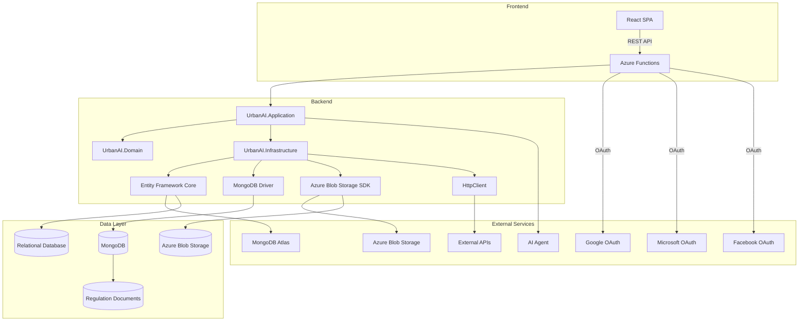

# UrbanAI Backend Component Diagram

## Component Descriptions

### Frontend Layer
- **React SPA**: Single Page Application built with Vite, React, and TypeScript
- Communicates with backend via REST API endpoints

### Backend Layer
- **Azure Functions**: Serverless functions handling HTTP requests with automatic scaling
- **UrbanAI.Application**: Business logic and application services
- **UrbanAI.Domain**: Core business entities and logic
- **UrbanAI.Infrastructure**: External concerns like data access and service communication
- **Entity Framework Core**: ORM for relational database operations
- **MongoDB Driver**: Direct database driver for MongoDB operations
- **Azure Blob Storage SDK**: Handles file storage operations
- **HttpClient**: Makes external API calls

### External Services
- **OAuth Providers**: Google, Microsoft, and Facebook authentication services
- **MongoDB Atlas**: Cloud-hosted MongoDB database service
- **Azure Blob Storage**: Cloud storage for files and images
- **External APIs**: Third-party services for regulation data
- **AI Agent**: External AI service for image classification and regulation crawling

### Data Layer
- **MongoDB**: Document database for regulation documents
- **Azure Blob Storage**: File storage for images and documents
- **Regulation Documents**: Stored regulatory information
- **Relational Database**: SQL Server for structured data
