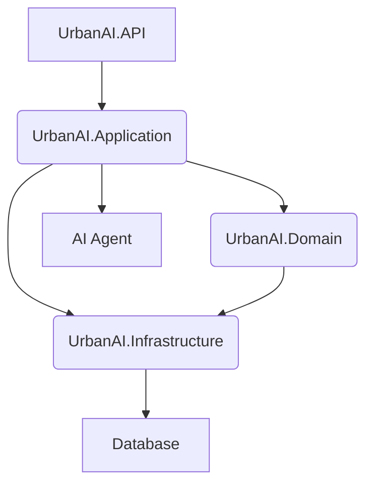

# UrbanAI Backend Component Diagram

**Explanation:**

- **UrbanAI.API:** The entry point for external requests, handling HTTP requests and responses. It depends on the Application layer.
- **UrbanAI.Application:** Contains the business logic and application services. It orchestrates operations between the Domain and Infrastructure layers.
- **UrbanAI.Domain:** Contains the core business entities and logic, independent of infrastructure concerns.
- **UrbanAI.Infrastructure:** Handles external concerns like data access (Database) and communication with other services (AI Agent).
- **Database:** Represents the data persistence layer (e.g., SQL Server for relational data).
- **AI Agent:** Represents the external AI service for tasks like image classification and regulation crawling.
