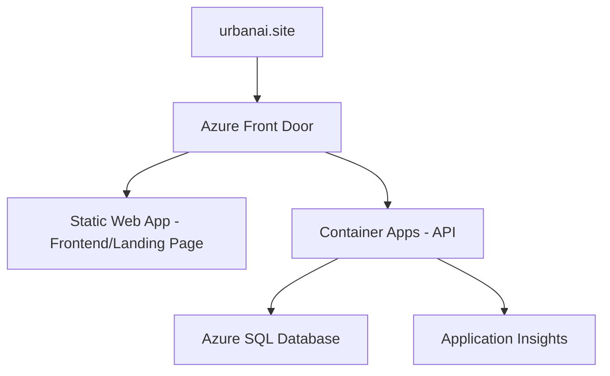

# UrbanAI Deployment Guide

This guide provides step-by-step instructions for deploying the UrbanAI application to Azure using GitHub Actions with cost-optimized hosting.

## Architecture Overview



## Prerequisites

1. **Azure Subscription** with sufficient permissions
2. **GitHub Account** with repository access
3. **GoDaddy Account** for domain management
4. **Azure CLI** installed locally
5. **PowerShell** (for Windows) or **Bash** (for Linux/Mac)

## Deployment Steps

### 1. Set Up Azure Resources

Run the PowerShell script to create all necessary Azure resources:

```powershell
# Navigate to project root
cd /path/to/UrbanAI

# Run the setup script
./infra/azure-setup.ps1 -ResourceGroupName "urbanai-rg" -SubscriptionId "your-subscription-id" -Environment "prod"
```

This will create:
- Resource Group
- Static Web App (Frontend/Landing Page)
- Container Apps Environment and App (API)
- Azure Container Registry
- SQL Server and Database
- Application Insights

### 2. Configure GitHub Secrets

Add the following secrets to your GitHub repository (Settings → Secrets and variables → Actions):

| Secret Name | Value Source |
|-------------|--------------|
| `AZURE_CREDENTIALS` | Azure Service Principal JSON |
| `AZURE_STATIC_WEB_APPS_API_TOKEN` | Static Web App deployment token |
| `ACR_NAME` | Azure Container Registry name |
| `RESOURCE_GROUP` | Azure Resource Group name |
| `ENVIRONMENT_NAME` | Container Apps Environment name |
| `SQL_CONNECTION_STRING` | Azure SQL connection string |

#### Create Azure Service Principal:

```bash
az ad sp create-for-rbac --name "urbanai-deploy" --role contributor \
    --scopes /subscriptions/{subscription-id}/resourceGroups/urbanai-rg \
    --sdk-auth
```

### 3. Configure Application Settings

In Azure Portal, configure the following application settings:

#### Container App Settings:
- `ConnectionStrings__DefaultConnection` = Your SQL connection string
- `FrontendBaseUrl` = `https://www.urbanai.site`
- `ApiBaseUrl` = `https://[container-app-url]`

#### Static Web App Settings:
- The landing page will be served from the root domain
- The "Get Started" button redirects to `/app` route

### 4. Set Up Custom Domain

Follow the instructions in [dns-setup.md](dns-setup.md) to configure your `urbanai.site` domain.

### 5. Deploy Application

Push changes to the `main` branch to trigger automatic deployment:

```bash
git add .
git commit -m "Deploy to production"
git push origin main
```

Monitor the deployment progress in GitHub Actions tab.

## Cost Estimation

| Service | Tier | Monthly Cost |
|---------|------|--------------|
| Static Web App | Free | $0.00 |
| Container Apps | Consumption | $0.10-0.50 |
| SQL Database | Basic | $5.00 |
| Application Insights | Free | $0.00 |
| **Total** | | **$5.10-5.50** |

**Cost Optimization Warning:** 
Avoid accidentally deploying the API to Azure App Service (B1 tier) as it costs ~$55/month. Always use Azure Container Apps for API hosting to maintain cost efficiency.

## Monitoring and Maintenance

### Application Insights

Monitor application performance and errors:
- URL: https://portal.azure.com → Application Insights → urbanai-insights
- Key metrics to watch: response time, error rate, throughput

### Database Maintenance

- Regular backups are automatically configured
- Monitor database performance in Azure Portal
- Scale up database tier if needed

### Security Updates

- Keep .NET Core runtime updated
- Regularly update npm packages
- Monitor Azure Security Center recommendations

## Troubleshooting

### Common Deployment Issues

1. **Build Failures**
   - Check GitHub Actions logs for specific error messages
   - Ensure all dependencies are correctly specified

2. **Database Connection Issues**
   - Verify connection string in Azure App Settings
   - Check SQL Server firewall rules
   - Ensure SQL Server allows Azure services

3. **Domain Configuration Issues**
   - Verify DNS records in GoDaddy
   - Check SSL certificate status in Azure Portal

### Useful Commands

```bash
# Check deployment status
az containerapp show --name urbanai-api --resource-group urbanai-rg

# View application logs
az containerapp logs show --name urbanai-api --resource-group urbanai-rg

# Restart application
az containerapp restart --name urbanai-api --resource-group urbanai-rg
```

## Cost Validation

After deployment, verify in Azure Portal that:
- API is running in Container Apps (not App Service)
- Container App is configured with Consumption Plan
- SQL Database is Basic tier ($5/month)

## Scaling Options

### Horizontal Scaling
- Container Apps automatically scale based on load
- Configure scaling rules in Azure Portal

### Vertical Scaling
- Upgrade SQL Database tier (Basic → Standard → Premium)
- Adjust Container App resource limits if needed

### Geographic Distribution
- Enable Azure CDN for Static Web App
- Configure Traffic Manager for multi-region deployment

## Backup and Disaster Recovery

### Automated Backups
- App Service: Enabled by default (30-day retention)
- SQL Database: Automated backups (7-35 day retention)

### Manual Backup Process
```bash
# Export database
az sql db export --admin-password {password} --admin-user {user} \
    --storage-key {storage-key} --storage-key-type StorageAccessKey \
    --storage-uri {storage-uri} --name {database-name} \
    --resource-group {resource-group} --server {server-name}
```

## Landing Page Features

The landing page includes:
- Responsive design with mobile support
- "Get Started" button that redirects to `/app`
- Feature showcase with three key benefits
- Privacy section with policy link
- Navigation smooth scrolling
- Download buttons for mobile apps (placeholder)

## Next Steps

1. Set up monitoring alerts
2. Configure automated testing in CI/CD pipeline
3. Implement blue-green deployment strategy
4. Set up backup and restore procedures
5. Configure security scanning and compliance checks
