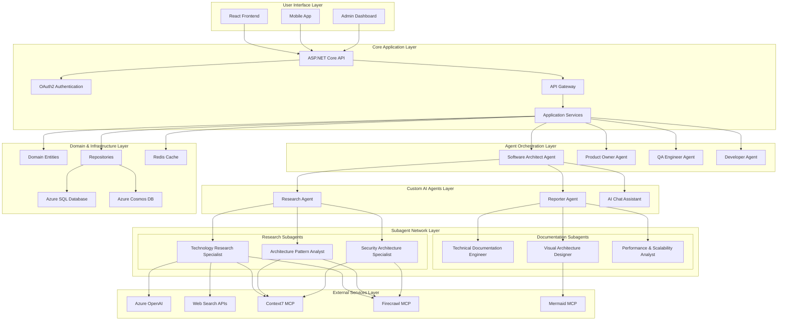
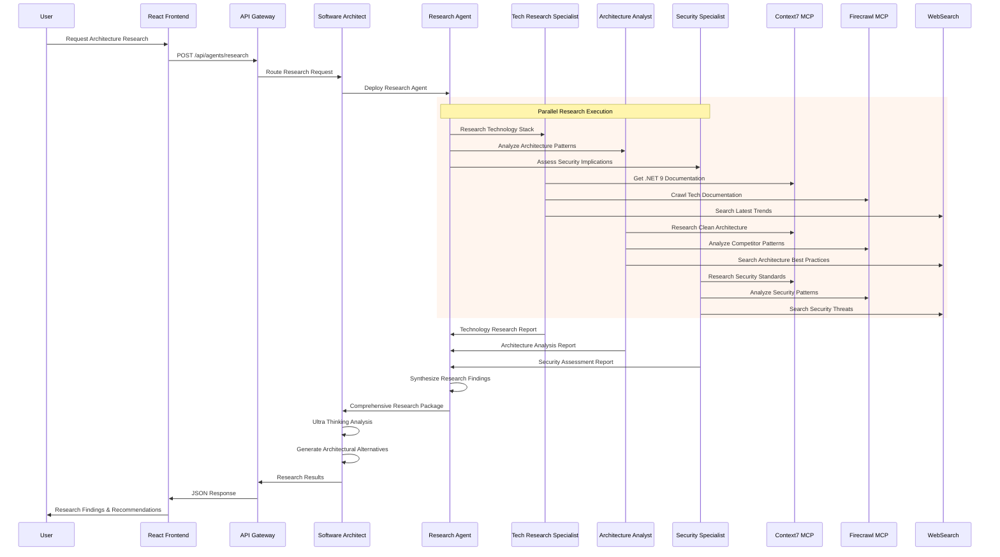
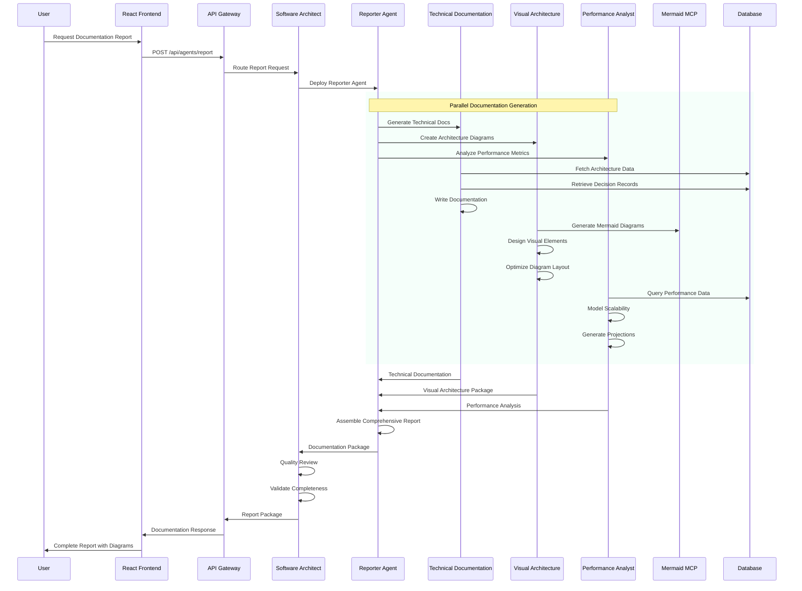
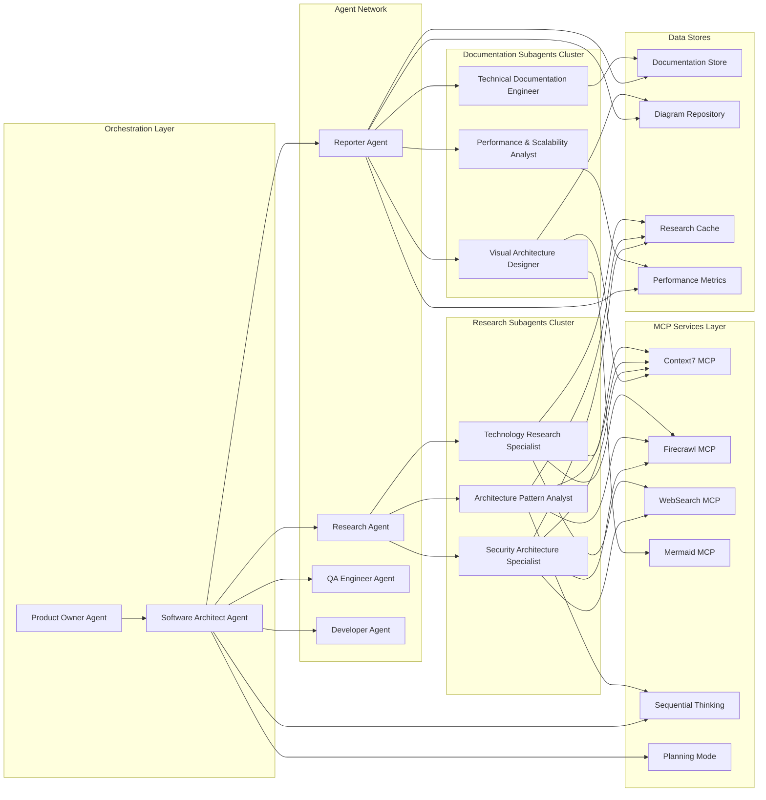
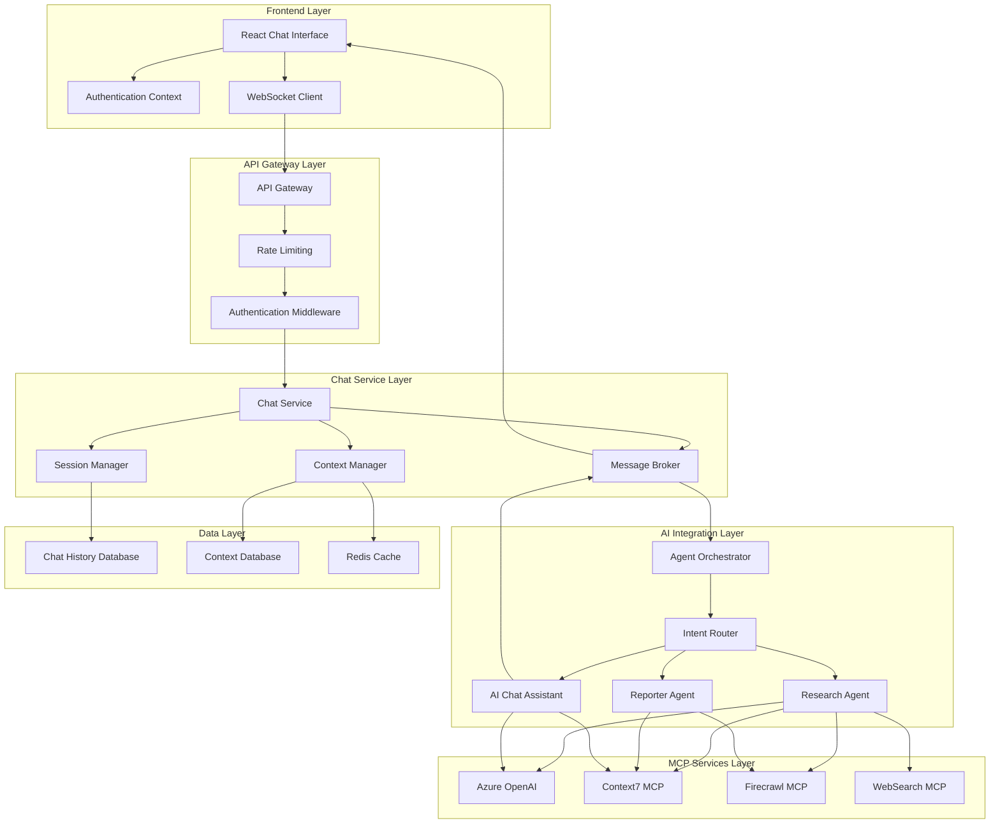
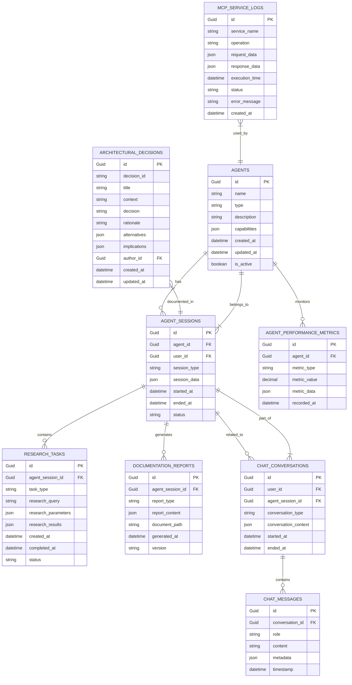
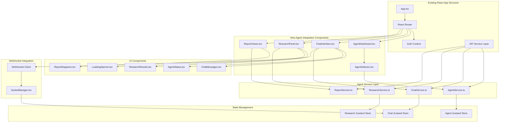
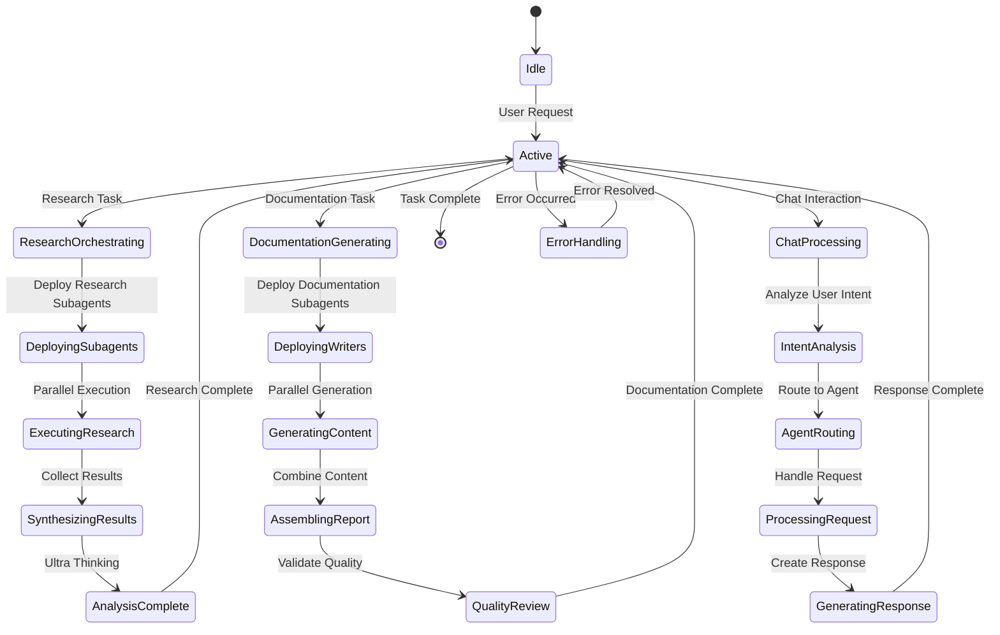
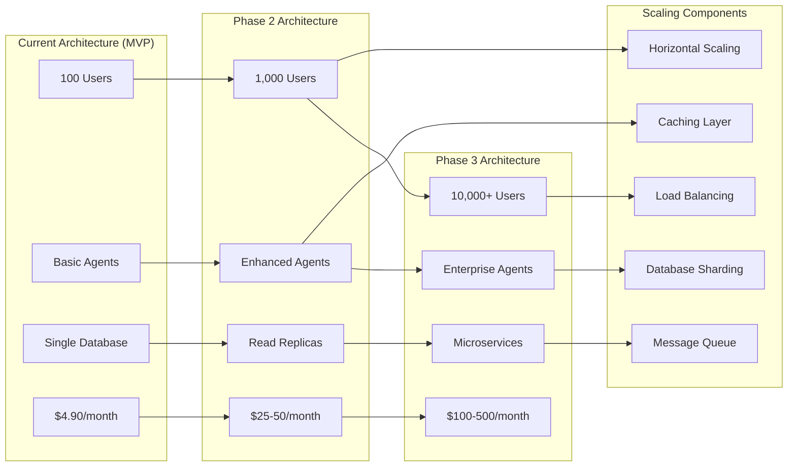

# UrbanAI Agent Architecture Documentation

## Visual Architecture Documentation

This document provides comprehensive visual documentation of the UrbanAI agent architecture, including system architecture, agent workflows, subagent interactions, and integration patterns.

## 1. High-Level System Architecture with Custom Agents Integration

## 2. Research Agent Detailed Workflow

## 3. Reporter Agent Detailed Workflow

## 4. Subagent Interaction Patterns and Data Flow

## 5. AI Chat Integration Architecture

## 6. Database Schema Extensions for Agent Data

## 7. Frontend Integration Patterns with Existing React App

## 8. Agent Communication Flow Patterns

## 9. Performance & Scalability Architecture

## 10. Security Architecture for Agent System

```mermaid
graph TB
    subgraph "Security Boundaries"
        UserBoundary[User Security Boundary]
        AgentBoundary[Agent Security Boundary]
        SystemBoundary[System Security Boundary]
    end

    subgraph "Authentication & Authorization"
        OAuth[OAuth2 Provider]
        JWT[JWT Token Validation]
        RBAC[Role-Based Access Control]
        AgentAuth[Agent Authentication]
    end

    subgraph "Data Protection"
        Encryption[Data Encryption]
        Masking[Data Masking]
        Audit[Audit Logging]
        Compliance[GDPR Compliance]
    end

    subgraph "Network Security"
        Firewall[Web Application Firewall]
        HTTPS[TLS/SSL Encryption]
        RateLimit[Rate Limiting]
        DDoS[DDoS Protection]
    end

    subgraph "Agent Security"
        Sandbox[Agent Sandbox]
        Validation[Input Validation]
        Monitoring[Agent Monitoring]
        Scanning[Vulnerability Scanning]
    end

    UserBoundary --> OAuth
    UserBoundary --> JWT
    UserBoundary --> RBAC

    AgentBoundary --> AgentAuth
    AgentBoundary --> Sandbox
    AgentBoundary --> Validation

    SystemBoundary --> Encryption
    SystemBoundary --> Audit
    SystemBoundary --> Firewall
    SystemBoundary --> HTTPS

    AgentBoundary --> Monitoring
    SystemBoundary --> RateLimit
    SystemBoundary --> DDoS
    SystemBoundary --> Scanning

    Encryption --> Compliance
    Audit --> Compliance
```

## Summary

These diagrams provide a comprehensive visual representation of the UrbanAI agent architecture, covering:

1. **High-level system architecture** with custom agents integration into the existing Clean Architecture
2. **Research and Reporter agent workflows** showing parallel execution and MCP service integration
3. **Subagent interaction patterns** demonstrating the network of specialized agents
4. **AI chat integration** with real-time communication and context management
5. **Database schema extensions** for storing agent data, research results, and documentation
6. **Frontend integration patterns** showing how to extend the existing React application
7. **Communication flow patterns** for agent orchestration and task execution
8. **Performance and scalability** architecture from MVP to enterprise scale
9. **Security architecture** for protecting agent interactions and data

The architecture maintains Clean Architecture principles while introducing a sophisticated agent system that enhances the platform's capabilities for urban issue reporting and resolution.