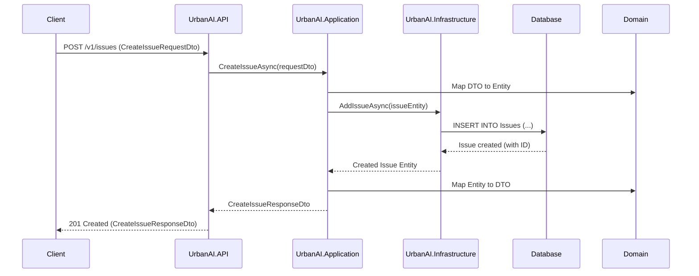

# UrbanAI Backend Sequence Diagram: Create Issue

**Explanation:**

1.  **Client** sends a POST request to the `/v1/issues` endpoint on the **UrbanAI.API** with the issue details in the request body.
2.  The **API** controller receives the request and calls the `CreateIssueAsync` method in the **UrbanAI.Application** layer, passing the `CreateIssueRequestDto`.
3.  The **Application** layer maps the `CreateIssueRequestDto` to a `Issue` entity from the **UrbanAI.Domain** layer.
4.  The **Application** layer calls the `AddIssueAsync` method in the **UrbanAI.Infrastructure** layer, passing the `Issue` entity.
5.  The **Infrastructure** layer's repository implementation interacts with the **Database** to insert the new issue record.
6.  The **Database** confirms the creation and returns the created issue (including the generated ID) to the **Infrastructure** layer.
7.  The **Infrastructure** layer returns the created `Issue` entity to the **Application** layer.
8.  The **Application** layer maps the created `Issue` entity back to a `CreateIssueResponseDto`.
9.  The **Application** layer returns the `CreateIssueResponseDto` to the **API** controller.
10. The **API** controller returns a `201 Created` response to the **Client**, including the `CreateIssueResponseDto` and a `Location` header pointing to the newly created resource.
