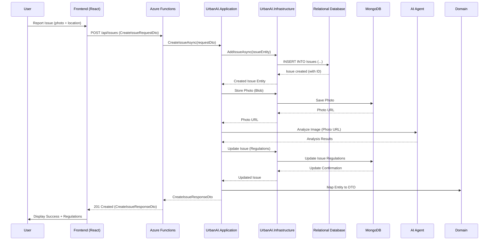

# UrbanAI Backend Sequence Diagram: Create Issue

**Explanation:**

1. **User** reports an issue through the **Frontend** application
2. **Frontend** sends POST request to Azure **Functions** endpoint
3. **Functions** HTTP trigger calls **Application** layer's `CreateIssueAsync` method
4. **Application** layer calls **Infrastructure** to add issue to **Database**
5. **Database** confirms issue creation and returns generated ID
6. **Infrastructure** stores photo in **MongoDB** and gets photo URL
7. **Application** sends photo to **AI Agent** for analysis
8. **AI Agent** returns analysis results with applicable regulations
9. **Application** updates issue with regulations via **Infrastructure**
10. **Infrastructure** updates **MongoDB** with regulation data
11. **Application** maps final entity to response DTO
12. **Functions** returns 201 Created response to **Frontend**
13. **Frontend** displays success message with regulations to **User**
