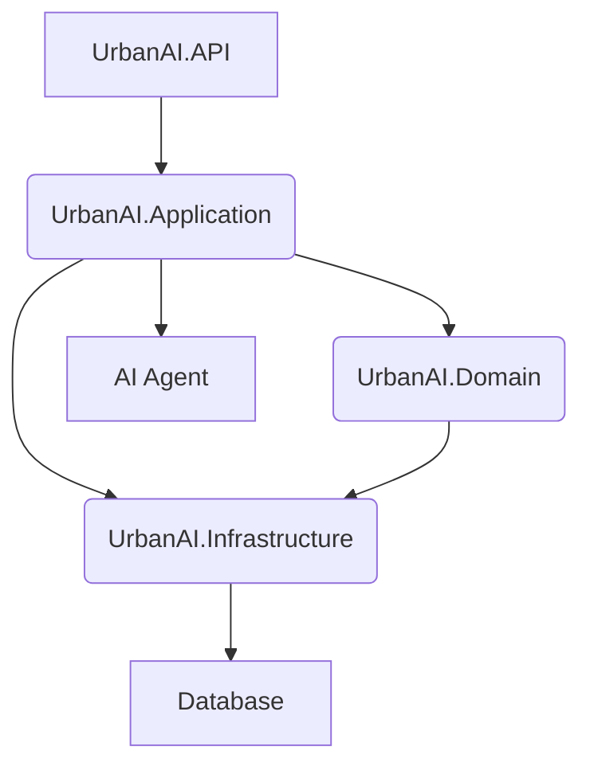

# Component Diagram

This page shows the high-level component architecture of the UrbanAI system.

## System Components

The UrbanAI backend follows a clean architecture pattern with clear separation of concerns:

## Component Descriptions

### UrbanAI.API
- **Purpose**: Web API layer and entry point for all client requests
- **Responsibilities**:
  - HTTP request/response handling
  - Authentication and authorization
  - API routing and endpoint management
  - Request validation and response formatting
  - OpenAPI/Swagger documentation
- **Technology**: ASP.NET Core 9.0

### UrbanAI.Application
- **Purpose**: Application services and business logic orchestration
- **Responsibilities**:
  - Business logic implementation
  - Use case coordination
  - Data transformation (DTOs)
  - External service integration
  - Command and query handling
- **Patterns**: Command/Query separation, Service pattern

### UrbanAI.Domain
- **Purpose**: Core business entities and domain logic
- **Responsibilities**:
  - Business entities and value objects
  - Domain interfaces and contracts
  - Business rule validation
  - Domain events
  - Core business logic (independent of infrastructure)
- **Characteristics**: Framework-agnostic, pure business logic

### UrbanAI.Infrastructure
- **Purpose**: External concerns and infrastructure services
- **Responsibilities**:
  - Database access and repositories
  - External API integrations
  - File storage operations
  - Email/notification services
  - Third-party service clients
- **Implementation**: Entity Framework Core, Azure services

### Database
- **Purpose**: Data persistence and storage
- **Responsibilities**:
  - Entity storage and retrieval
  - Data consistency and transactions
  - Query optimization
  - Data relationships and constraints
- **Technology**: SQL Server / Azure SQL Database

### AI Agent
- **Purpose**: Artificial intelligence and machine learning services
- **Responsibilities**:
  - Image classification and analysis
  - Geo-location processing
  - Regulation crawling and parsing
  - Natural language processing
  - Report generation assistance
- **Integration**: External AI services, Azure Cognitive Services

## Data Flow

1. **Client Request** → UrbanAI.API receives HTTP requests
2. **API Layer** → Routes to appropriate Application service
3. **Application Layer** → Orchestrates business logic using Domain entities
4. **Domain Layer** → Enforces business rules and validates operations
5. **Infrastructure Layer** → Handles persistence, external services, and AI integration
6. **Response** → Results flow back through the layers to the client

## Key Architectural Principles

- **Dependency Inversion**: Higher-level modules don't depend on lower-level modules
- **Separation of Concerns**: Each layer has distinct responsibilities
- **Testability**: Core business logic can be tested independently
- **Maintainability**: Changes to infrastructure don't affect business logic
- **Scalability**: Layers can be scaled independently

## Related Documentation

- [Sequence Diagrams](/Architecture/Sequence-Diagrams) - Process flows and interactions
- [API Documentation](/API) - Endpoint specifications and contracts
- [Infrastructure Setup](/Infrastructure) - Deployment and configuration
