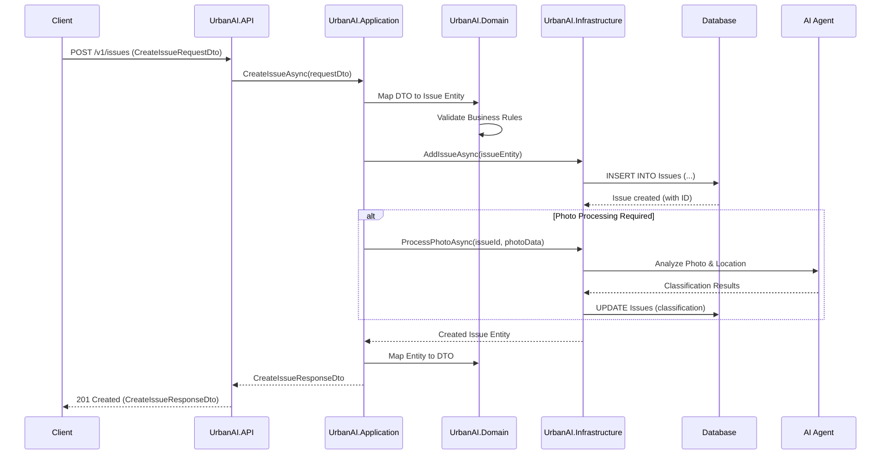
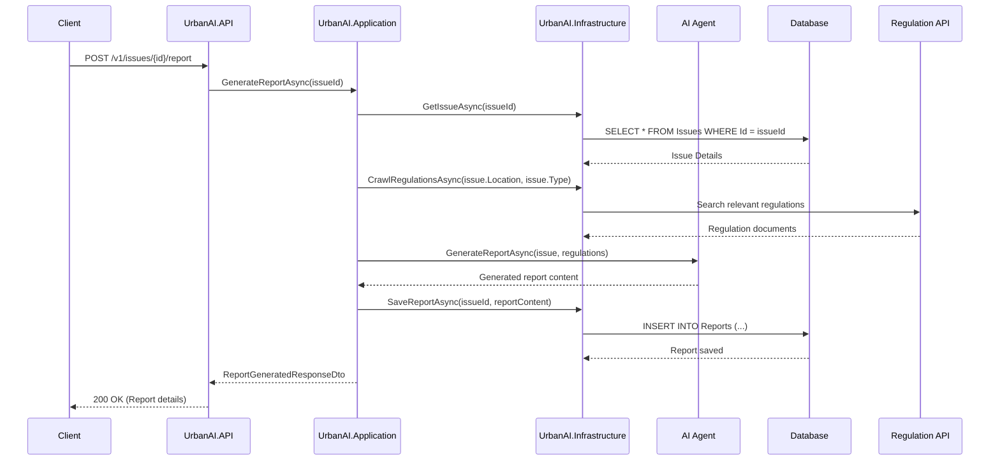
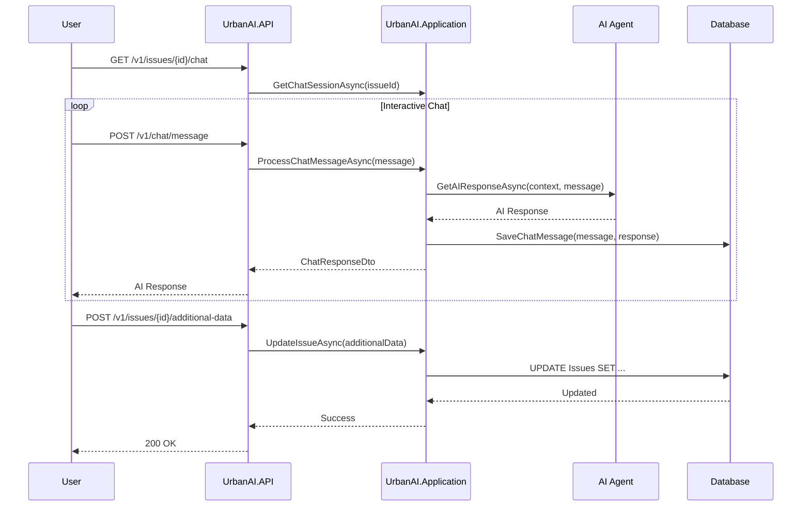

# Sequence Diagrams

This page contains sequence diagrams showing the flow of operations through the UrbanAI system.

## Create Issue Flow

This diagram shows how a new issue is created in the system, from the initial client request through all the architectural layers.

### Flow Description

1. **Client Request**: Client sends a POST request to `/v1/issues` with issue details
2. **API Layer**: Receives and validates the request, forwards to application layer
3. **Application Layer**: Orchestrates the business logic and coordinates between layers
4. **Domain Layer**: Validates business rules and creates the issue entity
5. **Infrastructure Layer**: Persists the issue to the database
6. **Database**: Stores the issue and returns the created record with ID
7. **Photo Processing** (if applicable): 
   - Processes uploaded photos using AI services
   - Classifies potential violations based on image and location
   - Updates the issue with classification results
8. **Response**: Returns the created issue details to the client

## Report Generation Flow

### Report Generation Steps

1. **Request**: Client requests report generation for a specific issue
2. **Issue Retrieval**: System retrieves the full issue details from database
3. **Regulation Crawling**: System searches for relevant local regulations and building codes
4. **AI Processing**: AI agent generates a formatted report using issue details and regulations
5. **Report Storage**: Generated report is saved to the database
6. **Response**: Client receives confirmation and report details

## User Interaction Flow

## Key Patterns

### Error Handling
- Each layer handles its own errors appropriately
- Domain layer validates business rules
- Infrastructure layer handles external service failures
- API layer returns appropriate HTTP status codes

### Data Flow
- DTOs are used for API contracts
- Domain entities represent business logic
- Repository pattern abstracts data access
- Services coordinate between layers

### Asynchronous Processing
- All database operations are async
- AI processing happens asynchronously
- Photo processing can be queued for background processing

## Related Documentation

- [Component Diagram](/Architecture/Component-Diagram) - System component overview
- [API Documentation](/API) - Detailed endpoint specifications
- [Error Handling](/Architecture/Error-Handling) - Error handling strategies
