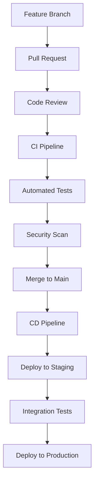

# UrbanAI System Patterns

## Architectural Patterns

### Clean Architecture Implementation
```
┌─────────────────────────────────────┐
│        UrbanAI.Frontend             │  ← React TypeScript SPA
│        (Presentation Layer)         │
└─────────────────────────────────────┘
                    │
┌─────────────────────────────────────┐
│        UrbanAI.API                  │  ← ASP.NET Core Web API
│        (Entry Point / Controllers)   │
└─────────────────────────────────────┘
                    │
┌─────────────────────────────────────┐
│      UrbanAI.Application            │  ← Use Cases & Application Logic
│      (Application Layer)            │
└─────────────────────────────────────┘
                    │
┌─────────────────────────────────────┐
│        UrbanAI.Domain               │  ← Entities & Business Rules
│        (Domain Layer)               │
└─────────────────────────────────────┘
                    │
┌─────────────────────────────────────┐
│     UrbanAI.Infrastructure          │  ← External Dependencies
│     (Infrastructure Layer)          │
└─────────────────────────────────────┘
```

### Data Flow Patterns

#### CQRS Pattern
- **Commands**: Modify data (CreateIssue, UpdateIssueStatus, etc.)
- **Queries**: Read data (GetIssues, GetIssueDetails, etc.)
- **Separation**: Different models for read/write operations

#### Repository Pattern
- **Interface Segregation**: IRepository<T> for each aggregate root
- **Implementation**: EF Core repositories in Infrastructure layer
- **Dependency Injection**: Registered in API startup

### Frontend Patterns

#### Component Architecture
```
Component/
├── Component.tsx          ← Main component
├── Component.test.tsx     ← Unit tests
├── Component.css          ← Styles
├── index.ts              ← Barrel export
└── types.ts              ← TypeScript definitions
```

#### State Management
- **Context API**: User authentication and global state
- **Local State**: useState for component-specific state
- **Server State**: React Query for API data fetching

## Development Workflow Patterns

### GitOps Workflow


### Testing Strategy
- **Unit Tests**: 80%+ coverage, xUnit + Moq for backend
- **Integration Tests**: API endpoints, database operations
- **E2E Tests**: Critical user journeys with Playwright
- **Performance Tests**: Load testing for scalability validation

### CI/CD Pipeline Pattern
```yaml
name: CI/CD Pipeline
on: [push, pull_request]

jobs:
  test:
    runs-on: ubuntu-latest
    steps:
      - uses: actions/checkout@v3
      - name: Setup .NET
        uses: actions/setup-dotnet@v3
      - name: Restore
        run: dotnet restore
      - name: Build
        run: dotnet build --no-restore
      - name: Test
        run: dotnet test --no-build --verbosity normal
      - name: Coverage
        uses: codecov/codecov-action@v3

  deploy:
    needs: test
    if: github.ref == 'refs/heads/main'
    runs-on: ubuntu-latest
    steps:
      - name: Deploy to Azure
        uses: azure/webapps-deploy@v2
```

## Security Patterns

### Authentication & Authorization
- **OAuth 2.0**: Microsoft Identity Platform integration
- **JWT Tokens**: Stateless authentication
- **Role-Based Access**: Citizen, Authority, Investor roles
- **API Security**: Bearer token validation

### Data Protection
- **Encryption**: Azure Key Vault for secrets
- **GDPR Compliance**: Data minimization and consent management
- **Audit Logging**: Track all data access and modifications
- **Secure Headers**: OWASP recommended headers

## Performance Patterns

### Frontend Optimization
- **Code Splitting**: Route-based and component-based splitting
- **Lazy Loading**: Images and components loaded on demand
- **Caching**: Service worker for offline capability
- **Bundle Analysis**: Webpack bundle analyzer for optimization

### Backend Optimization
- **Database Indexing**: Optimized queries with proper indexing
- **Caching**: Redis for frequently accessed data
- **Async Processing**: Background jobs for heavy operations
- **CDN**: Azure CDN for static assets

### Monitoring Patterns
- **Application Insights**: Comprehensive telemetry
- **Health Checks**: API endpoints for system health
- **Logging**: Structured logging with correlation IDs
- **Alerting**: Proactive monitoring and notifications

## Deployment Patterns

### Infrastructure as Code
```bicep
// Azure Bicep template pattern
resource appService 'Microsoft.Web/sites@2022-03-01' = {
  name: appServiceName
  location: location
  properties: {
    serverFarmId: appServicePlan.id
    httpsOnly: true
    siteConfig: {
      alwaysOn: true
      http20Enabled: true
      minTlsVersion: '1.2'
    }
  }
}
```

### Environment Configuration
- **Development**: Local development with hot reload
- **Staging**: Pre-production testing environment
- **Production**: Live environment with monitoring
- **Secrets Management**: Environment-specific secrets

## Error Handling Patterns

### Global Exception Handling
```csharp
// ASP.NET Core middleware pattern
public class ExceptionMiddleware
{
    private readonly RequestDelegate _next;
    private readonly ILogger _logger;

    public async Task InvokeAsync(HttpContext context)
    {
        try
        {
            await _next(context);
        }
        catch (Exception ex)
        {
            _logger.LogError(ex, "Unhandled exception");
            await HandleExceptionAsync(context, ex);
        }
    }
}
```

### Frontend Error Boundaries
```tsx
// React error boundary pattern
class ErrorBoundary extends Component {
  constructor(props) {
    super(props);
    this.state = { hasError: false };
  }

  static getDerivedStateFromError(error) {
    return { hasError: true };
  }

  componentDidCatch(error, errorInfo) {
    console.error('Error caught by boundary:', error, errorInfo);
  }

  render() {
    if (this.state.hasError) {
      return <ErrorFallback />;
    }
    return this.props.children;
  }
}
```

## Communication Patterns

### API Design
- **RESTful**: Resource-based endpoints with HTTP verbs
- **OpenAPI**: Comprehensive API documentation
- **Versioning**: URL-based API versioning (/v1/issues)
- **Pagination**: Consistent pagination for list endpoints

### Event-Driven Architecture
- **Azure Service Bus**: Reliable message queuing
- **Event Grid**: Event-driven notifications
- **SignalR**: Real-time updates for clients
- **WebHooks**: External system integrations

## Code Quality Patterns

### Naming Conventions
- **PascalCase**: Classes, interfaces, methods, properties
- **camelCase**: Parameters, local variables, private fields
- **kebab-case**: File names, URLs, CSS classes
- **UPPER_CASE**: Constants and environment variables

### Documentation Standards
- **XML Comments**: All public APIs documented
- **README Files**: Project and component documentation
- **Architecture Diagrams**: Visual system documentation
- **Code Comments**: Complex business logic explained

### Code Organization
- **Feature Folders**: Group related files together
- **Barrel Exports**: Clean import statements
- **Shared Modules**: Common utilities and components
- **Type Definitions**: Centralized TypeScript interfaces
